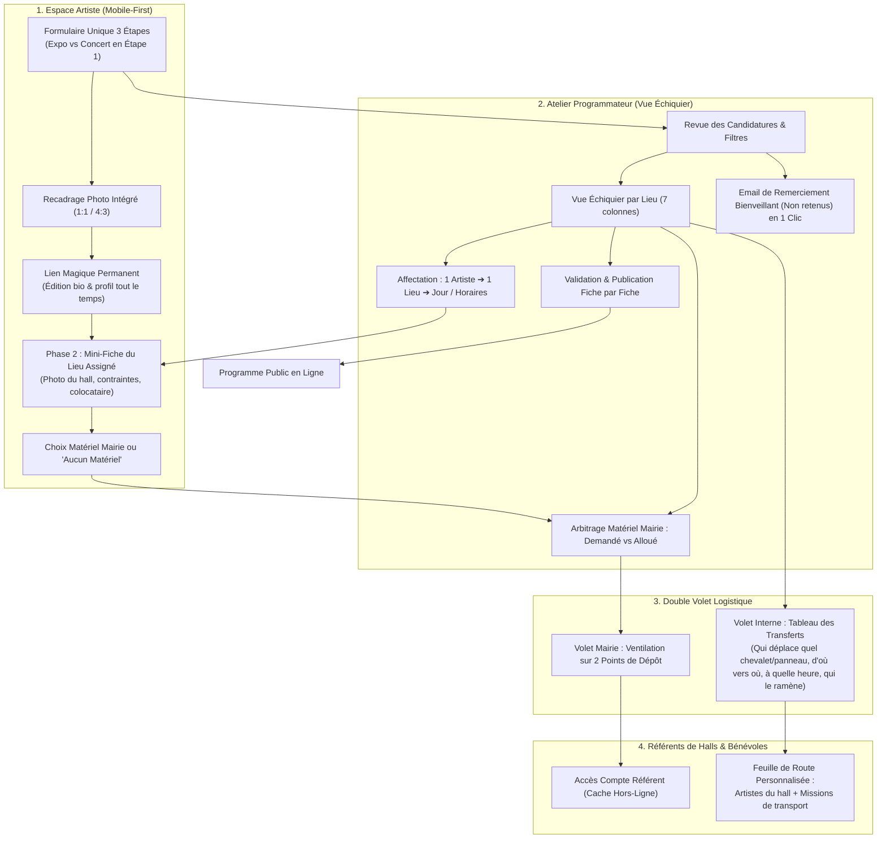

# 🏛️ Évolution 2027 : Plateforme Intégrée de Candidature, Programmation & Logistique

**Projet** : 1Hall1Artiste (Collectif Île Feydeau)  
**Horizon cible** : Février 2027 (Ouverture des inscriptions)  
**Dernière mise à jour** : 16 Septembre 2026  
**Statut** : Document de Cadrage & Spécifications Validées (Version Enrichie Multi-Perspectives)  
**Auteurs** : Julien Fritsch & Antigravity  

---

## 📋 Table des Matières

1. [Vision & Échelle Réelle](#1-vision--échelle-réelle)
2. [Périmètre Fonctionnel & Parcours Utilisateurs](#2-périmètre-fonctionnel--parcours-utilisateurs)
3. [Architecture Technique & Sécurité](#3-architecture-technique--sécurité)
4. [Modèle de Données Firebase RTDB (Cloisonné)](#4-modèle-de-données-firebase-rtdb-cloisonné)
5. [Double Volet Logistique : Mairie & Matériel Interne](#5-double-volet-logistique--mairie--matériel-interne)
6. [Design d'Interface & Expérience Utilisateur (UX)](#6-design-dinterface--expérience-utilisateur-ux)
7. [Analyse des Risques & Mitigations](#7-analyse-des-risques--mitigations)
8. [Stratégie de Tests & Validation](#8-stratégie-de-tests--validation)
9. [Feuille de Route (Roadmap jusqu'à Février 2027)](#9-feuille-de-route-roadmap-jusquà-février-2027)
10. [Registre des Décisions & Règles Métier Validées](#10-registre-des-décisions--règles-métier-validées)

---

## 1. Vision & Échelle Réelle

### 1.1 Échelle Réelle du Festival
* **17 expositions** réparties dans les halls privés de l'Île Feydeau.
* **10 concerts** (créneaux de 30 à 45 min, ex. à la Cour Ovale).
* **7 lieux actifs**.
* **2 points de livraison municipaux** desservant l'ensemble des 7 lieux.
* **~27 artistes / groupes retenus** au total pour le festival.
* **Un parc de matériel propre au Collectif** (panneaux de signalétique, chevalets, banderoles) disséminé dans des caves ou locaux de l'Île à transférer avant et après le festival.

### 1.2 Principes Directeurs
- **Abandon complet de Google Sheets** : l'application est la source unique de vérité.
- **Liberté & Simplicité pour le Programmateur** : une seule personne arbitre, sélectionne et affecte sans contrainte d'algorithme rigide.
- **Processus en 2 temps** :
  - *Phase 1 (Février)* : Candidature artistique pure (identité, bio, 1 photo recadrée, disponibilités).
  - *Phase 2 (Post-sélection)* : Déblocage de la logistique matériel une fois le lieu d'accueil connu.
- **Mise en relation humaine & Logistique collaborative** : coordination des référents pour les clés des halls, les livraisons Mairie et les transferts de matériel propre.

---

## 2. Périmètre Fonctionnel & Parcours Utilisateurs



### Module A : Candidature & Espace Artiste Dédié
1. **Formulaire Unique en 3 Étapes (Optimisé Mobile)** :
   - *Étape 1 - Qui êtes-vous ?* : Contact (Nom, Email, Téléphone), Choix d'aiguillage (*Exposition* vs *Concert*).
   - *Étape 2 - Votre Art* : 
     - Branche Expo : Démarche artistique, format/dimensions des œuvres, liens (Instagram, web).
     - Branche Concert : Nom du groupe, style musical, composition/membres, liens d'écoute/vidéo.
     - **Outil de recadrage photo intégré** (preview instantanée du rendu sur la future fiche).
   - *Étape 3 - Vos Disponibilités* : Samedi, Dimanche, ou les deux.
2. **Espace Privatif & Lien Magique Permanent** :
   - L'artiste peut peaufiner sa présentation et ses liens à tout moment.
   - En Phase 2 (après sélection) : affichage de la **Mini-Fiche de son Lieu** (photos du hall, luminosité, contraintes techniques, coordonnées du référent habitant, présence éventuelle d'un co-exposant).
   - Choix du matériel mairie avec bouton explicite : **"Je confirme que je n'ai besoin d'aucun matériel"**. Règle métier : *À la date limite de commande, toute absence de réponse est automatiquement clôturée à 0 matériel*.

### Module B : Atelier de Programmation (Le Curateur)
1. **Vue "Échiquier par Lieu" (Kanban)** :
   - 7 colonnes correspondant aux 7 lieux actifs.
   - Glisser-déposer ou sélection rapide des artistes retenus par lieu.
   - Saisie des tranches horaires des concerts (30-45 min) et du responsable bénévole du créneau (ex: Patricia, François, Julien).
2. **Tableau d'Arbitrage Matériel Mairie** :
   - Vue comparative : *Quantités demandées par les artistes* vs *Quantités attribuées par l'organisation* (pour gérer les plafonds de la mairie).
3. **Publication Granulaire** :
   - Bouton de bascule au programme public fiche par fiche.
4. **Gestion Bienveillante des Refus** :
   - Bouton d'envoi d'un email chaleureux et personnalisé aux artistes non retenus pour l'édition 2027.
   - Possibilité de réactiver / repêcher un candidat en un clic en cas de désistement imprévu.

### Module C : Double Volet Logistique (Mairie & Matériel Interne)
1. **Volet 1 - Commande Mairie (2 Points de Livraison)** :
   - Export automatique du bon de commande officiel ventilé sur les 2 points de dépôt municipaux.
2. **Volet 2 - Tableau des Transferts de Matériel Interne (Chevalets, Panneaux, Banderoles)** :
   - Répertoire du matériel propre au collectif avec son **lieu de stockage habituel** (ex: Cave du 8 quai Turenne, Local poubelles Kervégan, Appartement X).
   - Matrice des besoins par lieu (ex: 2 chevalets au 15 allée Duguay-Trouin, 1 panneau signalétique à l'entrée du 17 Kervégan).
   - **Génération automatique des Missions Aller / Retour** :
     - *Aller (Installation - Samedi matin)* : *"Qui déplace quoi, d'où vers où, à quelle heure ?"* (ex: *François prend 2 chevalets au 8 quai Turenne et les amène au 15 Duguay-Trouin samedi à 09h30*).
     - *Retour (Démontage - Dimanche soir)* : *"Qui ramène quoi et où ?"* (ex: *Julien ramène les 2 chevalets du 15 Duguay-Trouin vers la cave du 8 Turenne dimanche à 19h15*).

### Module D : Centre de Messagerie & Feuilles de Route
* Séquençage des envois :
  1. *Accusé de réception de candidature* (avec lien magique).
  2. *Annonce de la sélection* (avec découverte du lieu et coordonnées du référent).
  3. *Ouverture de la Phase 2 Matériel* (avec relance automatique J-7 avant clôture).
  4. *Email de non-sélection* (chaleureux, encourageant pour les futures éditions).
  5. *Courrier logistique début septembre* :
     - Pour les artistes : accès aux halls, consignes de retrait matériel aux 2 points mairie.
     - Pour les référents et bénévoles : **leur feuille de route logistique personnelle** (artistes accueillis + leurs missions de transfert de matériel aller/retour).

---

## 3. Architecture Technique & Sécurité

### 3.1 Stack Applicative
* **Frontend** : React 18, Vite, TypeScript, Tailwind CSS, shadcn/ui.
* **Base de Données** : Firebase Realtime Database (RTDB).
* **API Serverless** : Vercel Serverless Function unique consolidée (`api/festival.ts`) avec sous-routeur d'actions pour respecter scrupuleusement la **limite de 12 fonctions du plan Hobby**.
* **Médias** : Cloudinary (recadrage WebP/JPEG et compression avant upload).
* **Mailing** : Passerelle SMTP / REST sur le compte Google Gmail du Collectif avec cadence de 500ms entre chaque envoi.

### 3.2 Cloisonnement Anti-Concurrence (Race Conditions)
- L'artiste n'écrit que dans le sous-arbre `artistData/`.
- L'administrateur écrit dans le sous-arbre `adminData/` (affectations, statuts, validation matériel mairie, missions de transfert).

---

## 4. Modèle de Données Firebase RTDB (Cloisonné)

```
/editions/
  └── 2027/
      ├── config/
      │     ├── registrationsOpen: boolean
      │     ├── materialDeadline: string (ISO date)
      │     ├── deliveryPoints: [
      │     │     { id: "pt-nord", name: "Point Nord - Cour ...", address: "..." },
      │     │     { id: "pt-sud", name: "Point Sud - Quai ...", address: "..." }
      │     │   ]
      │     └── materialCatalogMairie: [
      │           { id: "grille", label: "Grille d'exposition (caddie)" },
      │           { id: "table", label: "Table brasseur 2m" },
      │           { id: "chaise", label: "Chaise" }
      │         ]
      │
      ├── internalInventory/  <-- Matériel propre au collectif (chevalets, panneaux)
      │     └── {itemId}/
      │           ├── label: string (ex: "Chevalet bois #1", "Panneau A-Frame")
      │           ├── defaultStorageLocationId: string (lieu de stockage habituel)
      │           └── assignedToLocationId: string (destination pour l'édition)
      │
      ├── transfers/  <-- Missions de transport aller / retour
      │     └── {transferId}/
      │           ├── itemId: string
      │           ├── fromLocationId: string
      │           ├── toLocationId: string
      │           ├── direction: "aller" | "retour"
      │           ├── scheduledTime: string (ex: "Samedi 09h30")
      │           ├── assignedPersonName: string (ex: "François")
      │           ├── assignedPersonPhone: string
      │           └── isDone: boolean
      │
      ├── locations/ (7 lieux actifs)
      │     └── {locationId}/
      │           ├── name: string
      │           ├── deliveryPointId: "pt-nord" | "pt-sud"
      │           ├── referent: { name: "François", phone: "06...", email: "..." }
      │           ├── accessInstructions: "Interphone Dupont, clé disponible chez..."
      │           ├── hallPhotos: [ "url_cloudinary_1" ]
      │           └── venueRules: "Accrochage uniquement sur grilles. Pas de scotch mural."
      │
      ├── applications/ (~27 retenus, ~80 candidatures)
      │     └── {applicationId}/
      │           ├── artistData/  <-- Modifiable par l'artiste via lien magique
      │           │     ├── type: "exposition" | "concert"
      │           │     ├── name: string
      │           │     ├── email: string
      │           │     ├── phone: string
      │           │     ├── presentation: string
      │           │     ├── thumbnail: string (Cloudinary avec recadrage)
      │           │     ├── specificFields: { ... }
      │           │     ├── links: { website, instagram, facebook }
      │           │     ├── daysRequested: ["samedi", "dimanche"]
      │           │     ├── materialRequest: { "grille": 2, "table": 1 }
      │           │     ├── materialConfirmedNoNeeds: boolean
      │           │     └── updatedAt: number
      │           │
      │           ├── adminData/   <-- Modifiable uniquement par l'admin
      │           │     ├── status: "candidat" | "retenu" | "non_retenu"
      │           │     ├── isPublished: boolean
      │           │     ├── assignedLocationId: string (1 des 7 lieux)
      │           │     ├── assignedDays: ["samedi", "dimanche"]
      │           │     ├── concertSchedule?: { saturday?: string, sunday?: string }
      │           │     ├── stageManager?: string (ex: "Patricia")
      │           │     ├── materialAllocated: { "grille": 2, "table": 1 }
      │           │     └── updatedAt: number
      │           │
      │           └── tokenHash: string (sécurité lien magique)
      │
      └── mailings/
            └── {mailingId}/
                  ├── type: "candidature" | "selection" | "materiel" | "refus" | "septembre"
                  └── sentLogs: [ { artistId, email, sentAt, status } ]
```

---

## 5. Double Volet Logistique : Mairie & Matériel Interne

### 5.1 Volet 1 - Commande Mairie
1. L'artiste dispose d'un bouton explicite : **"Je valide que je n'ai besoin d'aucun matériel"**.
2. À la date limite de commande, toute fiche sans réponse est clôturée automatiquement à 0 matériel.
3. Export officiel en un clic pour la Ville de Nantes ventilé sur les **2 points de dépôt**.

### 5.2 Volet 2 - Logistique des Transferts Internes (Chevalets, Panneaux)
L'application résout le casse-tête des objets qui voyagent sur l'Île :
1. **Cartographie du Stock** : chaque objet possède son lieu de stockage de base (ex: cave d'un habitant).
2. **Besoin événementiel** : l'organisateur affecte un chevalet ou un panneau à un lieu spécifique pour le festival.
3. **Plan de Tournée Automatique** :
   - Pour chaque objet, une mission **Aller** (qui le prend, où, quand, et où il l'amène) et une mission **Retour** (qui le ramène au stockage d'origine le dimanche soir) sont assignées à un bénévole / référent.
   - Les référents ont leur liste de missions directement affichée sur leur espace mobile (avec case à cocher *"Fait ✅"*).

---

## 6. Design d'Interface & Expérience Utilisateur (UX)

### 6.1 Côté Artiste (Candidat)
- **Formulaire à étapes aérées (Stepped Form)** avec indicateur de progression (1-2-3).
- **Recadrage visuel de la vignette** : aperçu en direct de l'effet "carte festival" avant validation.
- **Affichage de la Mini-Fiche du Hall** en Phase 2 (photos, contraintes d'accrochage, co-exposant).

### 6.2 Côté Programmateur & Logistique
- **Vue Échiquier (Kanban)** : vision globale immédiate des 17 expos et 10 concerts sur les 7 lieux.
- **Tableau de Bord des Transferts Internes** : vue synoptique des déplacements d'objets avec statut de réalisation.
- **Badges d'état visuels** :
  - 🟡 *Besoins matériel en attente*
  - 🟢 *Matériel confirmé (ou 0 matériel)*
  - 🌐 *Fiche publiée sur le site public*

### 6.3 Côté Référent de Lieu & Bénévole
- **Fiche Hall épurée et responsive**, avec boutons directs pour appeler les artistes du hall.
- **Feuille de Route Personnelle** : liste des artistes + missions de transport confiées (ex: *"Prendre les 2 panneaux au 8 Turenne à 10h"*).
- **Mise en cache automatique** pour fonctionner sans connexion internet à l'intérieur des immeubles.

---

## 7. Analyse des Risques & Mitigations

| Risque | Impact | Probabilité | Mitigation Validée |
|---|---|---|---|
| **Matériel collectif perdu ou oublié le dimanche soir** | Moyen | Élevée | Module de transferts internes avec check-list Aller / Retour nominative et statut *"Rapatrié ✅"*. |
| **Conflits d'écriture concurrentielle** | Élevé | Moyenne | Arborescence Firebase cloisonnée (`artistData` vs `adminData`). |
| **Zone blanche 4G dans les halls** | Élevé | Élevée | Cache local hors-ligne automatique pour les fiches référents. |
| **Délivrabilité via Gmail du collectif** | Élevé | Faible | Envois groupés temporisés (1 email toutes les 500ms). |
| **Plafond Vercel Serverless (12 max)** | Bloquant | Nulle | Point d'entrée unique `api/festival.ts` multiplexé. |
| **Désistement d'un artiste en mai** | Moyen | Moyenne | Bouton de bascule immédiate d'un candidat "Non retenu" vers "Retenu". |
| **Pénurie de matériel Mairie** | Moyen | Moyenne | Colonne "Matériel alloué" pour arbitrer manuellement en cas de coupe budgétaire municipale. |

---

## 8. Stratégie de Tests & Validation

1. **Tests Unitaires (Vitest)** :
   - Schémas Zod (tronc commun, branches expo/concert).
   - Ventilation Mairie (2 points de livraison) et calcul des missions de transfert Aller/Retour.
   - Règle de clôture automatique du matériel à date butoir.
2. **Tests d'Intégration & Concurrence** :
   - Écriture simultanée artiste / admin sans collision.
   - Validation du cache hors-ligne navigateur pour l'espace référent.
3. **Répétition Générale (Janvier 2027)** :
   - Test réel en équipe : saisie de candidatures fictives, affectation lieu, simulation d'une mission de transfert de chevalet, test des emails.

---

## 9. Feuille de Route (Roadmap jusqu'à Février 2027)

```
Octobre - Novembre 2026 : Conception des maquettes UI (Vue Échiquier, Formulaire, Module Transferts)
Novembre - Décembre 2026 : Développement API festival.ts, Formulaire à étapes, Espace Artiste
Janvier 2027            : Espace Référent avec cache hors-ligne, Module Transferts Internes, Répétition à blanc
Février 2027            : 🚀 OUVERTURE OFFICIELLE DES CANDIDATURES 2027 (Phase 1)
Mars - Avril 2027       : Sélection sur l'Échiquier, Phase 2 Matériel, Export Commande Mairie
Mai - Juin 2027         : Publication progressive des fiches au programme public
Début Septembre 2027    : Envoi des lettres logistiques finales et feuilles de route bénévoles
```

---

## 10. Registre des Décisions & Règles Métier Validées

1. **Période d'inscription** : Fenêtre fixe (Février 2027).
2. **Formulaire Unique à Branchement** : Un seul formulaire en 3 étapes avec tronc commun et questions adaptées selon le type (*Expo* vs *Concert*).
3. **Recadrage d'image** : Outil intégré de recadrage/prévisualisation de la vignette dès l'upload.
4. **Matériel en Phase 2** : Pas de demande de matériel en février. Débloqué uniquement après affectation du lieu d'accueil.
5. **Mini-Fiche Lieu pour l'artiste** : Photos du hall, contraintes d'accrochage et coordonnées du référent visibles sur l'espace artiste dès la sélection.
6. **Bouton 0 matériel & Clôture automatique** : Bouton explicite pour confirmer l'absence de besoin ; clôture automatique à 0 si non répondu à la date butoir.
7. **Curateur Unique** : Une seule personne arbitre et compose le programme.
8. **Vue Échiquier** : Back-office sous forme de tableau de bord par lieu (7 colonnes) pour une lisibilité parfaite.
9. **Logistique Interne (Chevalets / Panneaux)** : Tableau de gestion des transferts Aller / Retour avec affectation nominative (*qui prend quoi, où, quand, et qui le ramène*).
10. **Comptes Référents avec Cache Hors-Ligne** : Consultation des fiches d'artistes et des missions de transfert garantie même dans les halls sans 4G.
11. **Catalogue Mairie** : Catalogue restreint à moins de 10 références standard.
12. **2 Points de Livraison Mairie** : La commande officielle est ventilée automatiquement selon les 2 points de dépôt.
13. **Distinction Demandé vs Alloué** : Arbitrage possible en cas de dotation municipale inférieure aux souhaits des artistes.
14. **Emails via Gmail Collectif** : Envois cadencés pour assurer une délivrabilité parfaite sans surcoût.
15. **Refus Bienveillant & Repêchage** : Email chaleureux pour les non-retenus et possibilité de réactivation rapide si désistement.
16. **Publication Fiche par Fiche** : Contrôle total et progressif de la visibilité sur le site public.
17. **Cloisonnement Firebase** : Séparation stricte `artistData` / `adminData` contre les écrasements concurrents.
18. **Plafond Vercel Hobby respecté** : API factorisée en 1 point d'entrée unique (`api/festival.ts`).
