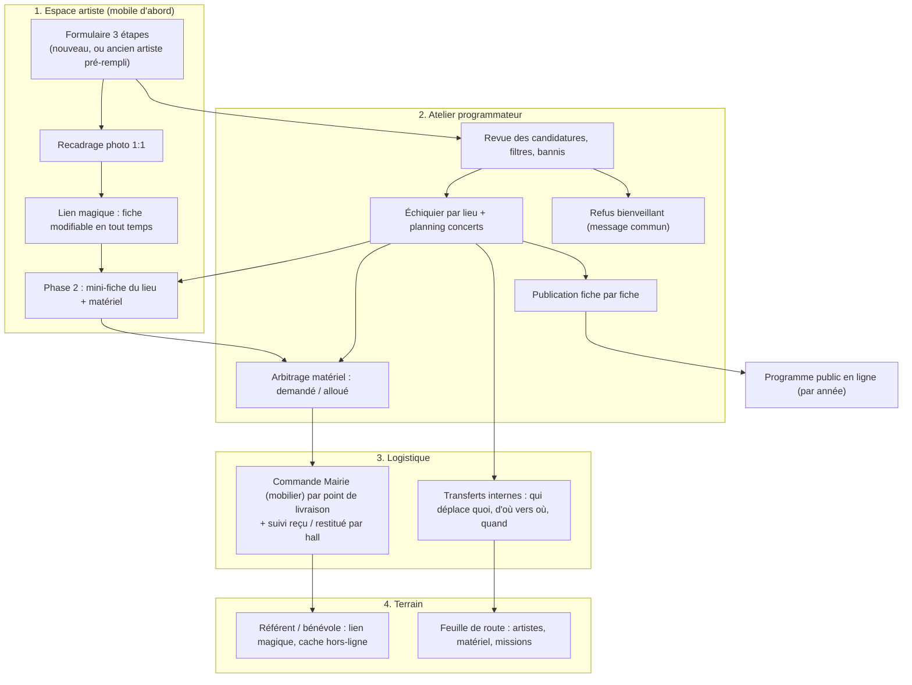
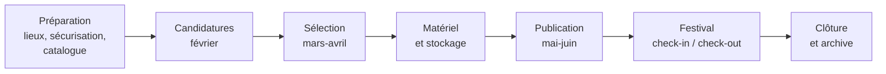

# SPECS 2027 : candidatures, programmation, logistique, multi-éditions

**Projet** : 1Hall1Artiste (Collectif Île Feydeau)· 
**Ouverture des candidatures** : février 2027· 
**Cadrage initial** : 16 septembre 2026· 
**Dernière mise à jour** : 23 septembre 2026· 
**Statut** : brouillon complet à valider.

Conventions : `*` obligatoire · `[Dn]` décision à valider (section 15) · 🔒 lecture seule.

---

## Sommaire

0. Vision, échelle et principes (issu du cadrage)
1. Ce que le code impose (et qui change le cadrage)
2. Ce que révèlent les données réelles
3. Modèle multi-années
4. Rôles, accès, sécurité
5. Cycle de vie et états
6. Écrans et champs : artiste
7. Écrans et champs : programmateur
8. Écrans et champs : logistique
9. Écrans et champs : référent, bénévole, public
10. Messagerie
11. Workflows
12. Bannissement et modération
13. Reprise de l'existant (migration 2026)
14. Non fonctionnel, tests, feuille de route ajustée
15. Décisions à valider et informations manquantes
16. Risques et mitigations
17. Registre des décisions du cadrage (statut)

---

## 0. Vision, échelle et principes

### 0.1 Échelle du festival

- **~17 expositions** dans les halls privés de l'Île Feydeau ;
- **~10 concerts** de 30 à 45 min (Cour ovale) ;
- **~27 artistes/groupes retenus** ; ~80 candidatures attendues.
- **Lieux** : **au moins 10 en 2026** (9 halls d'exposition + Cour ovale), 13 espaces au fichier « Cours » (2.7).
- **2 points de livraison** de la Ville desservent les lieux (9 quai Turenne et 16 allée Duguay Trouin).
- **Matériel du Collectif** (chevalets, panneaux, banderoles) réparti dans des halls et caves, à déplacer avant et après le festival (sur place 2026 : 9 chevalets répartis, 2.7).
- **Une visite guidée** existe en parallèle (24 visites, 198 inscriptions en 2026) et partage l'application, les e-mails et la base. **Idée retenue** : informer les inscrits du reste du programme (concerts juste avant ou après leur visite, jeux, ateliers, expositions proches) : voir E25.

### 0.2 Principes directeurs

1. **Abandon de Google Sheets** : l'application devient la source unique de vérité (le Sheet reste en repli pendant la saison 2026-2027).
2. **Liberté et simplicité pour le programmateur** : une personne arbitre, sélectionne et affecte, sans algorithme rigide ; les contrôles avertissent, ils ne bloquent que les cas graves (banni).
3. **Deux temps** :
   *** *Phase 1 (février)* candidature artistique seule (identité, présentation, photo recadrée, disponibilités) ;
   *** *Phase 2 (après sélection)* matériel, une fois le lieu connu.
4. **Mise en relation humaine** : coordination des référents pour les clés, la réception du matériel et les transferts de matériel propre.
5. **Mémoire d'une année sur l'autre** : artistes, visites, statistiques et bannissements se conservent ; l'ancien artiste retrouve sa fiche.

### 0.3 Vue d'ensemble des parcours


### 0.4 Pile technique (état réel)
* Frontend React 18 + Vite + TypeScript + Tailwind + shadcn/ui · 
* Firebase Realtime Database par REST (1.1) · 
* Fonctions Vercel (plan **Hobby**, 12 fonctions max : `festival.ts` consolidé) · 
* Cloudinary pour les images · 
* EmailJS (compte Gmail du Collectif, 200 envois/mois) pour les e-mails automatiques · 
* Cron Vercel quotidien existant.

---

## 1. Ce que le code impose

| # | Constat dans le code | Conséquence sur les specs |
|---|---|---|
| C1 | **12 fonctions Vercel sur 12** (`api/*.ts` hors `_*`) : `artist-link, artist-update, community, favorites, guide-code-create, program, share, visit-attendance, visit-emails, visit-register, visit-tours, visit-waitlist`. | Aucune nouvelle fonction. On **fusionne** `artist-link` + `artist-update` dans un `festival.ts` à sous-actions (12 → 11) et on y ajoute les nouvelles actions. `program.ts` (GET mis en cache) reste séparé. |
| C2 | **Pas de Firebase Auth ni de SDK admin.** Accès RTDB par REST avec le secret legacy (`FIREBASE_DB_SECRET`), règles = tout fermé (`.read/.write: false`). | Fini les *custom claims* et l'écriture directe côté navigateur : **tout passe par l'API**. Les règles RTDB restent fermées. |
| C3 | **Jetons HMAC sans état** (`api/_token.ts`) : artiste 30 j, admin 8 h, inscription 24 h, un secret par type. Un jeton artiste couvre **plusieurs fiches d'un même e-mail**. | Pas de `tokenHash` en base. La **révocation** exige un compteur `linkVersion` par e-mail, glissé dans le jeton (compatible : absent = version 0). |
| C4 | **Admin = un mot de passe partagé** (`ADMIN_PASSWORD`) → jeton 8 h. Pas de comptes nominatifs. | **Décision : comptes nominatifs (identifiant + mot de passe) pour les admins, référents et membres du collectif** (4.1). Le mot de passe partagé disparaît à terme ; le journal d'audit trace chaque personne. |
| C5 | **Google Sheets = source du programme** (`_sheets.ts`, `program.ts`, cache 1 h). L'`artistId` est le **slug du nom**, avec suffixe `-2` en cas de doublon. | 2027 : RTDB devient la source (objectif « abandon de Sheets »). Les ids 2026 sont **conservés** pour ne pas perdre les fiches éditées (`artist-overrides`). |
| C6 | **Overrides artiste** (`artist-overrides/{id}`) : 5 champs autorisés (`presentation, instagram, facebook, website, thumbnail`). | Deviennent la fiche durable `artists/{id}` (section 3). La liste blanche s'élargit. |
| C7 | **Upload photo Cloudinary avec preset non signé** partagé avec la galerie communautaire. | Risque d'abus à l'ouverture publique du formulaire. Voir 4.4. |
| C8 | **Limitation de débit par instance serverless** (en mémoire, `_rate-limit.ts`, `_admin.ts`). | Insuffisante pour un formulaire public ouvert en février. Voir 4.4. |
| C9 | **Visites guidées** : `tours`, `registrations`, `waitlist` en RTDB, **sans notion d'édition**. Les inscriptions sont **effacées par une purge quotidienne** après `retentionDays()` (RGPD) ; un « bilan des éditions passées » existe côté guide (`GuidePortal.tsx`, autour de la ligne 1145). | Ajouter `edition` aux visites, conserver les visites et leurs **statistiques agrégées** définitivement (section 3.5). |
| C10 | **Crons** : un seul (`/api/visit-emails?type=daily`, 04:00). Hobby : 2 crons max, exécution au mieux quotidienne. | La clôture du matériel s'ajoute au cron existant (pas de nouveau cron). |
| C11 | **EmailJS** unique (un modèle `EMAILJS_TEMPLATE_ID`) via Gmail. | Un seul gabarit générique (objet + corps en variables) sert aux 13 e-mails ; vérifier le **quota mensuel** du plan EmailJS `[D10]`. |
| C12 | `LOCATION_IDS` (17 ids) est **dupliqué** dans `_sheets.ts` et `src/data/locations.ts`. | Une seule table `locations` en RTDB, alimentée par le fichier « Cours » (2.7). |

### 1.1 Base de données : rester sur Firebase RTDB (recommandé)
**Décision proposée : on garde Firebase RTDB.** Arguments tirés de l'export réel :
- **Volume minuscule** : 323 Ko au total, dont 98 Ko de favoris. Les artistes, participations, créneaux et missions de 2027 pèseront moins de 1 Mo, historique compris. Aucune contrainte de performance.
- **Déjà en production**, avec des outils écrits et testés : REST, `rtdbPutIfMatch` (écriture conditionnelle contre les conflits), index par e-mail, sauvegardes par export JSON.
- **Le multi-années tient sans effort** : les données sont rangées par année (`editions/2027/…`). Une requête « toutes les participations de cet artiste » passe par un index (`entries_by_artist`), pas par une jointure.
- **Changer coûterait cher pour peu de gain** : migration des visites en production, réécriture de `_visit-db.ts` (754 lignes), nouveaux secrets, nouvelle sauvegarde, et un risque sur l'appli des visites qui fonctionne.

Limites à connaître et leurs parades :
| Limite de RTDB | Parade |
|---|---|
| Pas de requête libre ni de jointure | Index dénormalisés maintenus par l'API (`entries_by_artist`, `artists_by_email`, `bans_by_key`) |
| Pas de transaction multi-nœuds | `rtdbPutIfMatch` sur le nœud sensible (créneau, allocation) ; écritures multi-chemins par `PATCH` à la racine |
| Pas de schéma imposé | Validation Zod dans l'API (la seule porte d'écriture) |
| Sauvegarde manuelle | Export JSON planifié (cron hebdomadaire vers un stockage, ou rappel dans la checklist) ; export avant chaque migration |

**Quand reconsidérer** : si le besoin devient l'analyse (statistiques sur dix ans, requêtes croisées libres) ou si plusieurs équipes écrivent en même temps. Alors une base SQL (Postgres via la Marketplace Vercel) devient pertinente ; le modèle de la section 3 est déjà relationnel et se transposerait tel quel.

**Corrections au cadrage d'origine** : « 7 lieux actifs » est inexact. Les données 2026 montrent au moins **9 halls d'exposition** (quai Turenne 8, 9, 10, 11 ; rue Kervégan 17, 32 ; allée Duguay-Trouin 11, 15, 16) **plus** la Cour ovale (concerts). Le nombre de colonnes de l'échiquier est donc **dynamique** : les lieux actifs de l'édition.

---

## 2. Ce que révèlent les données réelles

### 2.1 Le formulaire 2026 (Google Forms)
Champs actuels : horodateur, e-mail, prénom et nom, « deux lignes pour vous présenter », téléphone, Instagram, Facebook, site, liens vers des exemples de travail, exemples d'expositions, dimension type des œuvres, type de disposition attendue, **jours (samedi/dimanche/les deux) avec avertissement « œuvres non surveillées la nuit »**, remarques. Colonnes **ajoutées à la main** ensuite : Samedi, Dimanche, Adresse expo (id de lieu), Type d'évènement.

Enseignements :
- **Le matériel se demandait en 2026 en texte libre** (« plusieurs grilles… une ou deux tables », « 4 grilles d'expo », « cimaises si disponibles, sinon chevalets », « grand escabeau », « brancher un petit compresseur »). **En 2027 : un nombre par type de matériel et par artiste** (E6) ; le champ « remarques » reste pour le reste.
- **Pas de photo** dans le formulaire : les vignettes viennent du portail, après coup.
- **Le type ne se limite pas à expo/concert** : Atelier, Escape Game, Exposition (colonne « Type d'évènement »), et le fichier concerne aussi la danse, le conte, la lecture. `kind` doit être extensible.
- **Disposition et dimensions** sont des contraintes d'affectation réelles (murs, grilles, suspendu, balcon, table, « en regard », « à côté de X ») : à conserver comme champs dédiés, pas noyés dans la bio.
- **Demandes de voisinage** (« je suis dans le groupe de tel autre artiste ») : champ `groupWith`.
- **Questions techniques** (peindre sur place, compresseur, prise, escabeau) : elles se posaient en « remarques ». En 2027 : **un bloc « Besoins techniques » détaillé** (électricité, rallonge, éclairage directionnel, etc. : E1, bloc « Besoins techniques »).
- **Stockage la nuit** : les œuvres restent sans surveillance de samedi à dimanche. Les artistes présents les deux jours ont besoin d'une solution (démonter, ou stocker chez un habitant) : **demande de stockage** en m² et en volume, résolue par l'organisation (E26).
- **Statut de reprise** : un candidat 2026 indique avoir été sélectionné l'année précédente puis s'être désisté pour un empêchement, et demande une seconde chance. Voir 12.3 : un désistement justifié ne doit pas pénaliser ; **aucun motif de nature médicale n'est recopié dans l'application ni dans ce document**.

### 2.2 Anomalies constatées (à traiter à l'import, section 13)
| Anomalie | Lignes | Traitement |
|---|---|---|
| Lignes de test datées `03/06/2026` (format sans heure) | John Do ×2, Urban Sketchers | Marquer `isTest`, ne pas importer ou importer marqués |
| Même artiste sur **2 lieux** (John Do : Duguay-Trouin 15 et Turenne 11) | 2 lignes | 2 *participations* pour 1 artiste (modèle 3.1) |
| `Non / Non` aux deux jours, adresse vide | Pauline Burnol (Camondo), Yeline Jung, Marion Peeters | Candidature valide **non placée** : statut `candidat` ou `desiste`, pas de suppression |
| Dates aux deux formats (`JJ/MM/AAAA` et `JJ/MM/AAAA hh:mm:ss`) | toutes | Normaliser en ISO |
| Compte Instagram saisi sous quatre formes (URL, `@nom`, nom seul, URL à paramètres) | ~10 | Normaliser en URL `https://instagram.com/nom` ; conserver l'original |
| Liens sans schéma (`www.…`) ou hors sujet (« Céline Ranger peintre ») | ~8 | `https://` ajouté si domaine plausible, sinon champ « note » |
| Textes avec retours ligne, espaces insécables, caractères invisibles (U+200B) | une ligne | Nettoyer |
| Téléphone saisi sous plusieurs formes (collé sans espace, avec espaces, préfixe étranger `+34`) | toutes | Normaliser E.164 |
| E-mail d'un compte anonyme/temporaire (`john-doe.fr`, `mailo.com`) | tests | Sans effet ; le bannissement/détection de doublon s'appuie sur l'e-mail normalisé |

### 2.3 Contacts musique et danse
Structure : quatre sections (**écoles de musique, ensembles amateurs, ensembles professionnels, conteurs**), une ligne par personne et par ensemble.
- **Une personne, plusieurs ensembles** : Marc Bohy (3 ensembles), Pauline Court (chorale en 2 formations).
- **Statut de contact écrit en texte libre** dans « Taille / divers » et « Présentation » : « Pas de réponse depuis 2 ans » (deux contacts), « Pas de mail », « Mail invalide », « Déménage à l'étranger », « Suggestion Julien ».
- **Noms d'ensemble différents entre les fichiers** : `Aperto !` (contacts) / `Studio Aperto` (concerts) ; `Ensemble de violoncelles du conservatoire` / `Ensemble de violoncelle du Conservatoire` ; `Chorale Label Diva` / deux lignes `(Choeur mixte)` `(Choeur de femmes)`. → rapprochement par e-mail et téléphone, pas par nom.
- Les contacts sont en fait des **prospects** : des artistes connus, non encore candidats. Ils doivent vivre dans la même table que les artistes (section 3.2).

### 2.4 Programme des concerts (Cour ovale)
- **Une ligne par créneau** ; un ensemble peut avoir un créneau samedi et un autre dimanche, à **heures différentes**, avec des **responsables différents** (Patricia, Hélène, Julien, François).
- **Créneaux proposés mais non confirmés** : Nota bene a `15:30 - 16:00` le samedi sans « Oui » ; ligne 6 : un créneau `17:00 - 17:30` **sans groupe** (à pourvoir).
- Durées observées : 30 et 45 min, 15 min d'intervalle.
- Le responsable est écrit à la main, avec une espace finale (`François `) : **c'est une erreur de saisie**. Les responsables sont **des membres du collectif** : ils sont choisis dans la liste des membres (comptes, E20), jamais saisis au clavier.
- La Cour ovale accueille les concerts (`quai-turenne-9-concert` est l'id de repli dans `program.ts`), **et peut aussi accueillir une ou plusieurs expositions** : un lieu peut donc porter à la fois des créneaux de concert et des expositions (`accepts: [expo, concert, atelier…]`, E13).

### 2.5 Le tableau Matériels 2026 (ce que l'organisation fait réellement)
**Catalogue de la Ville : 13 références au tableau, dont 7 seulement gérées par le Collectif** (le mobilier). **L'électricité (6 références) est commandée par les artistes eux-mêmes** : le Collectif n'en gère ni la commande, ni le retrait, ni le retour. Le catalogue géré tient donc en 7 références (< 10 : la décision n° 11 du cadrage est maintenue).
| Famille | Références (code Ville) | Mode d'obtention |
|---|---|---|
| Mobilier | 01 Table pliante · 03 Chaise pliante · 05 Banc pliant · 06 Grille d'exposition 1,20 × 2 m · 20 Panneau paravent · 20 Vitrine d'exposition · 21 Stand parapluie 2 × 2 m + lests | **Livré selon les possibilités, ou retrait en magasin** |
| Électricité | 01 Rallonge 3 m · 02 Rallonge 5 m · 03 Rallonge 10 m · 04 Multiprise · 18 Coffret 6 prises 220 V-16 A · 32 Projecteur halogène | **Commandée par l'artiste lui-même** (retrait en magasin) : hors logistique du Collectif, l'application n'affiche qu'une consigne |
Les codes `20` (paravent et vitrine) apparaissent deux fois : erreur de saisie probable, à confirmer.

Ce que le tableau montre du fonctionnement :
- **Le matériel est réceptionné, stocké et restitué par un responsable par hall**, dont l'e-mail figure dans la dernière colonne (« Personne(s) en charge de la réception, du stockage, de la manutention et de la restitution »). Une même personne peut gérer plusieurs halls (16 allée Duguay-Trouin et 17 rue Kervégan). 
- Le **référent de lieu est donc le destinataire du matériel**.
- **Les quantités sont totalisées par hall** (ligne « Total »), à partir des demandes par artiste. Exemples : 8 quai Turenne = 7 chaises, 4 bancs, 11 grilles, 5 paravents, 2 vitrines ; Cour ovale = 34 bancs pour les concerts.
- **Chaque référence a une colonne « Retour »** : la restitution est suivie article par article, pas seulement la livraison.
- **Deux circuits d'obtention** : livraison, ou retrait en magasin. Pour le mobilier non livré, le retrait est une vraie mission de transport (personne, véhicule, créneau) qui n'existait pas dans mon modèle.
- **Un tableau « Déplacement de matériel »** existe déjà (Qui · Quoi · Avant · Après · Quand) : c'est l'ancêtre du module de transferts.
- **Les chevalets, cimaises et escabeaux ne sont pas dans le catalogue de la Ville** : ce sont du matériel du Collectif ou à trouver ; ils relèvent de l'inventaire interne.
- **La Cour ovale** est répertoriée avec deux adresses (11 rue Kervégan, 9 quai Turenne) et deux contacts. **Règle générale** : certains bâtiments ont **deux entrées, donc deux adresses, et peuvent avoir plusieurs responsables** (E13).

### 2.6 Ce que montre l'export Firebase
| Constat | Chiffre | Effet sur la spec |
|---|---|---|
| Volume total | 323 Ko | RTDB suffit (1.1) |
| Visites (`tours`) | 24, **toutes en 2026**, toutes `status: upcoming` (le statut n'est jamais passé à `completed`) | Ajouter `edition` ; la fin de visite se calcule par la date, pas par le statut |
| Inscriptions (`registrations`) | 198 : 123 confirmées, 26 présentes, 43 annulées, 5 `attente_validation` (ancien statut), dont 1 seule effacée | Les visites ont eu lieu les 19 et 20 septembre ; à la date de l'export (23/09) **aucune purge n'a encore tourné** (0 visite avec `batchDeleteExecuted`). La purge quotidienne efface les inscriptions après `retentionDays()`. Statistiques 2026 **capturées le 23/09 par vos soins** (3.5) |
| File d'attente | 12 | |
| `artist-overrides` | 28 fiches, 5 champs seulement | Base de départ des `artists` durables |
| `john-do-escape-game` et `john-do-escape-game-2` | 2 fiches (données de test ?) | Fusion ou suppression à l'import |
| Favoris (`user-favorites`) | 1 213 entrées, 98 Ko | Hors périmètre, à ne pas toucher |
| `visit_audit_logs` | 27 lignes | Modèle d'audit existant, à réutiliser plutôt que d'en inventer un |
| Codes guides | 6 | Inchangé |

### 2.7 Le fichier « Cours » : les lieux réels
Treize lignes : adresse, **syndic**, type d'espace (`Hall`, `Cour`, `Hall et cour`, `Hall et très petite cour`, `Rue`), contacts, téléphones, e-mails, **nombre de chevalets**. (Les coordonnées personnelles ne sont pas recopiées ici ; elles seront importées par script.)
Ce qu'il apprend :
- **Un lieu = un ou plusieurs contacts** (jusqu'à trois au 32 rue Kervégan). Le modèle « un référent » ne suffit pas : liste de contacts avec rôle.
- **Le syndic est une donnée à part entière** (Gaschignard, SERGIC, Cabinet Thierry, Cabinet Moison, Syndic 4 Immo…) : l'autorisation d'utiliser un hall ou une cour passe par lui. Champ `syndic` + « accord obtenu ».
- **Un même bâtiment porte plusieurs adresses** (« 9 quai Turenne / 11 rue Kervégan » = Cour ovale ; « 17 rue Kervégan / 11 quai Turenne » ; « 11 allée Duguay-Trouin / 20 rue Kervégan »). Champ `adresses[]`.
- **Un bâtiment peut avoir deux espaces de syndics différents** (17 rue Kervégan : hall, et « cour côté quai Turenne » du Cabinet Bertaud-Graff, sans contact). Modèle `spaces[]` sous le lieu.
- **Les chevalets sont stockés dans les lieux** : 9 au total (1 dans la plupart, 2 au 11 allée Duguay-Trouin, 0 au 11 bis quai Turenne et rue Duguesclin). C'est l'inventaire interne (E18) : lieu de stockage = lieu.
- **Rue Duguesclin** est un « lieu » sans contact, sans syndic, sans chevalet : espace de rue, sans hall.
- **Le 3 place de la Petite Hollande** figure avec une ligne d'en-tête parasite (« Syndic / Prénom / Nom / Téléphone / Emails / 9/12 ») : à nettoyer à l'import. Il est **en travaux** : il a été ouvert (2026) et **rouvrira plus tard**. D'où un **statut du lieu** (`actif · en_travaux · ferme`) avec date de réouverture prévue (E13).
- **Incohérence à trancher** : le tableau Matériels attribue le 16 allée Duguay-Trouin à un contact (celui du 17 rue Kervégan), le fichier « Cours » à un autre. Le responsable de réception de chaque hall doit être **explicite** dans la fiche du lieu.
- Les contacts des halls sont **des habitants** : ce sont des données personnelles à protéger (4.3), à ne montrer qu'à qui en a besoin.

---

## 3. Modèle multi-années

### 3.1 Principe : trois niveaux
```
artists/{artistId}                 ← identité durable, toutes années  (acts : artiste, groupe, ensemble)
   └─ participations à des éditions
editions/{year}/entries/{entryId}  ← une participation : lieu, jours, créneaux, statut, matériel
   └─ slots (concerts) / missions (transferts)
```
Un artiste existe **une fois** ; chaque année, il a 0, 1 ou plusieurs **participations** (John Do : 2 lieux ; Label Diva : 2 formations). Les visites suivent la même logique (3.5).

### 3.2 `artists/{artistId}` (durable)
| Champ | Type | Notes |
|---|---|---|
| `name`* | texte ≤ 80 | Nom d'affichage |
| `kind`* | `exposition · concert · danse · conte · atelier · jeu · visite · autre` | Extensible ; « catégorie » libre en plus |
| `origin`* | `candidature · prospect · import2026 · manuel` | D'où vient la fiche |
| `contact` | `{ name, email, phone, role }` | Personne à joindre ; plusieurs artistes peuvent partager un e-mail |
| `contact.emailStatus` | `ok · invalide · absent` | Vient de « Mail invalide » / « Pas de mail » |
| `contactStatus` | `a_contacter · contacte · relance · sans_reponse · indisponible · declined` | Suivi des prospects |
| `contactNote` | texte ≤ 500 | « Déménage à l'étranger », « Suggestion Julien » |
| `category` | `ecole_musique · amateur · professionnel · conteur · …` | Section du fichier contacts |
| `presentation`, `links{instagram,facebook,website,youtube,tiktok,other[]}` | | Repris du portail |
| `thumbnail`, `photos[]` | URL Cloudinary | |
| `members`, `director` | texte | Ensembles |
| `aliases[]` | noms alternatifs | `Aperto !` ↔ `Studio Aperto` |
| `personKey` | e-mail normalisé | Sert au rapprochement |
| `ban` | voir 12 | Absent = non banni |
| `notes` | texte interne | Jamais visible de l'artiste |
| `mergedInto` | artistId | Après fusion de doublons |
| `firstSeenYear`, `createdAt`, `updatedAt` | | |
Index : `artists_by_email/{emailKey}/{artistId}` (déjà le mode de fonctionnement du portail).

### 3.3 `editions/{year}`
| Nœud | Contenu |
|---|---|
| `config` | dates (ouverture, fermeture, annonce, butoir matériel, livraison Mairie, jours du festival), `registrationsOpen`, `status` (`preparation · candidatures · selection · materiel · publie · termine · archive`), textes de mail, plafonds |
| `venues/{locationId}` | activation du lieu cette année : référent, consignes, photos, capacité, électricité, point de livraison |
| `catalog` | catalogue matériel Mairie géré par le Collectif (7 références en 2026 : mobilier, livré ou retrait magasin) ; `electricityInstructions` : consigne affichée aux artistes pour commander l'électricité eux-mêmes |
| `hallMaterial/{locationId}` | par hall : responsable de réception, quantités demandées/allouées/**reçues/restituées** par référence |
| `entries/{entryId}` | participations (3.4) |
| `slots/{slotId}` | créneaux de concert (3.4) |
| `inventory`, `transfers` | matériel interne et missions (section 8) |
| `mailings/{id}` | envois et journal |
| `volunteers/{id}` | bénévoles/référents de l'année (nom, téléphone, rôle) |
| `audit/{id}` | journal d'audit |
Racine : `meta/currentEdition` (année en cours), `locations/{locationId}` (référentiel des bâtiments, identique d'une année à l'autre : nom, adresse, coordonnées carte, id historique), `publicProgram/{year}` (projection publique).

### 3.4 `editions/{year}/entries/{entryId}` : la participation
| Champ | Type | Notes |
|---|---|---|
| `artistId`* | réf | |
| `status`* | `candidat · retenu · non_retenu · desiste · annule` | + `waitlist` `[D2]` |
| `submittedAt` | ISO | Ex-« Horodateur » |
| `artistData` | objet | Ce que l'artiste écrit (ci-dessous) |
| `adminData` | objet | Ce que seul l'admin écrit (ci-dessous) |
| `previousEntryRef` | `year/entryId` | Pour « repostuler en un clic » |
`artistData` (miroir du formulaire, section 6) : `kind`, `title`, `presentation`, `discipline`, `worksCount`, `dimensions`, `layout`, `hangingPreference`, `wishNeighbors`, `needsPower`, `liveDemo`, `workLinks[]`, `pastShows[]`, `daysRequested`, `nightPolicyAck`, `message`, `photo`, `materialRequest{ref:qty}`, `materialConfirmedNoNeeds`.
`adminData` : `locationId`, `assignedDays[]`, `materialAllocated{ref:qty}`, `isPublished`, `internalNote`, `priority`, `tags[]`, `decisionAt`, `decisionBy`.
**Séparation `artistData` / `adminData`** : conservée (elle évite les écrasements). Comme tout passe par l'API, la séparation est appliquée **dans le code**, pas par des règles RTDB.

`slots/{slotId}` (concert) : `entryId`, `locationId`, `day` (`samedi|dimanche`), `start`, `end`, `status` (`propose · confirme · libre`), `managerId` (bénévole). Un créneau `libre` n'a pas d'`entryId` (cas « 17:00 - 17:30 sans groupe »). Une entrée concert peut avoir plusieurs créneaux.

### 3.5 Visites guidées et années
- Ajouter `edition` (année) à `tours/{id}` : rempli à la création (année de `date`) ; **migration** : renseigner les visites existantes depuis leur date.
- **Conserver** : la visite (titre, date, lieu, capacité, guides, labels) reste indéfiniment.
- **Effacer** (comportement actuel, RGPD) : les inscriptions nominatives après le délai `retentionDays()` (purge quotidienne `batchDeletePostTour`).
- **Statistiques 2026** : capturées à la main le 23/09, avant la purge. **Pas de reprise** dans l'application (décidé : sans importance, conservées dans un e-mail) ; `tourStats` ne s'applique qu'aux visites à partir de 2027.
- **Nouveau** : à l'effacement, écrire un résumé permanent `tourStats/{tourId}` = `{ edition, capacity, registered, places, present, absent, cancelled, waitlist, noShowRate, closedAt }`. Alimente le taux d'absentéisme (aujourd'hui non mesuré, cf. `overbookingSeats`) et le bilan par édition.
- Écran « Historique des visites » (E19) : filtre par année, totaux, taux de présence.
- À vérifier au moment de coder : ce que fait déjà le « bilan des éditions passées » (`GuidePortal.tsx:1145`), pour ne pas dupliquer.

### 3.6 Reconduction d'une année à l'autre
**Principe retenu : c'est l'ancien artiste qui candidate de nouveau ; on ne l'inscrit pas d'office.** Il retrouve ses informations déjà enregistrées et les met à jour (E1b).
- L'artiste connu s'identifie par son e-mail (E1b) ; une fiche existante est reconnue, ses données durables sont **pré-remplies**, et une nouvelle **participation** est créée pour l'édition ouverte.
- L'ouverture d'une nouvelle édition (E14) copie seulement la **configuration** : activation des lieux, référents, consignes, catalogue matériel, textes de mail. Aucune participation n'est copiée.
- Une invitation par e-mail (M14) reste **facultative** : pour annoncer l'ouverture aux anciens artistes et aux prospects. Les bannis en sont exclus.

---

## 4. Rôles, accès, sécurité

### 4.1 Rôles réels (code)
| Rôle | Authentification actuelle | 2027 |
|---|---|---|
| Artiste | Lien magique HMAC 30 j, multi-fiches par e-mail | Inchangé + `linkVersion` (révocation) |
| Admin : **super-admin, programmateur, logisticien** (3 niveaux) | Mot de passe partagé → jeton 8 h | **Compte nominatif** (identifiant + mot de passe), jeton de session 8 h |
| Guide (visites) | Code d'accès (`GuideAccessCode`, renouvelé chaque année) | Inchangé |
| Référent de lieu, membre du collectif (bénévole, responsable de créneau) | n'existe pas | **Compte nominatif** (identifiant + mot de passe), jeton de session 14 jours (usage dans les halls sans réseau) |
| Public | aucun | Lecture de `publicProgram/{year}` via `/api/program` |

**Comptes (référents, membres, admins)** : décision, **identifiant + mot de passe**.
| Point | Règle |
|---|---|
| Stockage | `users/{userId}` : `login` (e-mail)*, `displayName`*, `role` (`superadmin · programmateur · logisticien · referent · membre`)*, `locationIds[]`, `passwordHash` (**scrypt** de Node `crypto`, sel aléatoire par compte, sans nouvelle dépendance), `status` (`invite · actif · suspendu`), `sessionVersion`, `createdAt`, `lastLoginAt`. **Jamais de mot de passe en clair**, ni en base ni dans les logs |
| Création | Par un admin ; e-mail d'**activation** avec lien à usage unique valable 48 h, l'utilisateur choisit son mot de passe (1 e-mail par compte, à compter dans le quota) |
| Mot de passe | 12 caractères minimum (phrase de passe acceptée), pas de règle de composition, refus d'une courte liste de mots de passe courants |
| Connexion | `POST` sur `festival.ts` (action `login`) → jeton HMAC signé (secret dédié `USER_SECRET`), même mécanique que `_token.ts` ; **verrouillage 15 min après 5 échecs**, compteur en RTDB (pas en mémoire) |
| Session | Admin 8 h ; référent et membre 14 jours (renouvelée à l'usage), pour tenir sans réseau ; déconnexion = purge du cache local des données de contact |
| Réinitialisation | E-mail de réinitialisation (lien 1 h), ou remise à zéro par un admin (mot de passe provisoire à changer) |
| Révocation | `sessionVersion` dans le jeton : suspendre un compte invalide toutes ses sessions |
| Secours | `ADMIN_PASSWORD` reste **temporairement** comme accès de secours, retiré une fois les comptes admins créés |
| Non retenu en 2027 | Double authentification (à reconsidérer si un compte admin est compromis) |
Effet : chaque action du journal d'audit porte **un nom** ; « François a coché fait » devient possible. L'artiste garde son **lien magique** (pas de compte).

### 4.2 Permissions
| Fonction | Artiste | Admin | Référent/bénévole | Public |
|---|---|---|---|---|
| Déposer une candidature | ✅ (fenêtre ouverte) | ✅ (saisie manuelle) | | |
| Modifier sa fiche et ses participations | ✅ ses fiches | ✅ | | |
| Retenir, refuser, affecter, publier | | ✅ | | |
| Demander du matériel | ✅ (phase 2) | ✅ | | |
| Arbitrer le matériel, exporter la commande | | ✅ | | |
| Gérer lieux, inventaire, missions | | ✅ | 👁 les siennes, coche « fait » | |
| Fiche de sécurisation d'un bâtiment (E28) | | ✅ | 👁 ses bâtiments, signale un risque | |
| Check-in / check-out d'un artiste (E27) | ✅ le sien | ✅ | ✅ valide pour ses halls | |
| Demande de stockage (E26) | ✅ la sienne | ✅ arbitre | 👁 celles de ses halls | |
| Voir e-mail/téléphone d'un artiste | soi-même | ✅ | artistes de ses lieux | ❌ |
| Bannir, débannir, fusionner | | ✅ | | |
| Envoyer des mailings | | ✅ | | |
| Voir programme publié | ✅ | ✅ | ✅ | ✅ |

**Droits des trois niveaux d'admin (D7, décidé : trois niveaux)**
| Fonction | Super-admin | Programmateur | Logisticien |
|---|---|---|---|
| Comptes : créer, suspendre, changer les rôles (E20) | ✅ | | |
| Édition : dates, ouverture, statut, archivage, catalogue (E14) | ✅ | | 👁 |
| Candidatures : retenir, refuser, repêcher, désister (E8, E9) | ✅ | ✅ | 👁 |
| Échiquier, créneaux de concert, zones (E10, E10b) | ✅ | ✅ | 👁 |
| Publier, dépublier | ✅ | ✅ | |
| **Bannir, débannir**, fusionner, file « bloquées » (E16) | ✅ | ✅ | signale un manquement |
| Prospects et copie des adresses en CCI (E15) | ✅ | ✅ | |
| Matériel : arbitrage, commande, suivi reçu/restitué (E11, E12) | ✅ | 👁 | ✅ |
| Inventaire et missions de transfert (E18, E19) | ✅ | 👁 | ✅ |
| Stockage de nuit (E26) | ✅ | 👁 | ✅ |
| Fiches lieux, plans, zones, photos (E13) | ✅ | ✅ | ✅ |
| Sécurisation des bâtiments (E28) | ✅ | 👁 | ✅ |
| Check-in/out : consulter, solder un écart (E27) | ✅ | 👁 | ✅ |
| Messagerie : envoyer M4, M5, M8, M14 | ✅ | ✅ | |
| Messagerie : envoyer M9, M11, M12, M15, M16, M17 | ✅ | ✅ | **prépare le message, ne l'envoie pas** |
| Journal d'audit complet | ✅ | | |
**Validé** : le logisticien **signale** un manquement (il ne bannit pas) ; **seuls le super-admin et le programmateur envoient des e-mails** (le logisticien les prépare) ; les trois niveaux modifient les fiches lieux. Le **programmateur reste une seule personne** (décision n° 7 du cadrage) ; les autres niveaux peuvent avoir plusieurs comptes.

### 4.3 Règles de sécurité
- Le navigateur **n'écrit jamais en RTDB** ; l'API vérifie le jeton, applique la liste blanche de champs et la règle « artiste = ses fiches seulement » (comme `artist-update.ts` aujourd'hui : l'id doit figurer dans le jeton).
- Ordre de vérification conservé : **jeton artiste d'abord, admin ensuite** (sinon un porteur de lien pourrait éditer une autre fiche en joignant un `artistId`).
- Projection publique séparée : jamais d'e-mail, de téléphone ni d'`adminData` dans `publicProgram`.
- Textes libres échappés à l'affichage ; URL en `http(s)` uniquement (déjà fait dans `_overrides.ts`).
- Le bannissement n'est **jamais** révélé à l'intéressé (12.2).
- RGPD : mention à l'inscription ; **conservation longue pour les artistes, musiciens et membres du collectif** (mémoire de l'association), **courte pour les visites** (12.4) ; suppression à la demande (les données **et** la photo Cloudinary) ; motif de bannissement factuel et relu (12.4).
- **Contacts d'habitants** (téléphone, e-mail des référents de lieu) : visibles des seuls admins et de la personne concernée ; jamais dans la projection publique.

### 4.4 Points de vigilance à traiter avant l'ouverture publique
1. **Cloudinary** : remplacer le preset non signé par un envoi **signé côté API** (ajoute `CLOUDINARY_API_SECRET`), ou au minimum un preset dédié 2027 limité en taille/format/dossier. Sans cela, n'importe qui peut remplir votre espace de stockage via le formulaire ouvert.
2. **Limitation de débit persistante** : la Map en mémoire se réinitialise à chaque instance. Utiliser un compteur en RTDB (`rate/{clé}`, avec `rtdbPutIfMatch` déjà présent) sur : dépôt de candidature (par IP et par e-mail), « retrouver mon lien », connexion admin.
3. **CORS** : `Access-Control-Allow-Origin: *` sur les routes d'écriture ; restreindre au domaine de l'app.
4. **Anti-robot** : champ piège (honeypot) + délai minimal de saisie ; captcha en dernier recours.
5. **Jeton dans l'URL** : `ArtistEdit` le lit dans l'URL ; privilégier le fragment `#` pour qu'il n'atteigne ni les journaux serveur ni les en-têtes `Referer`.
6. **Secret RTDB legacy** : reste utilisé par `_firebase.ts` ; à ne jamais exposer côté client (il ne l'est pas aujourd'hui).

---

## 5. Cycle de vie et états

### 5.1 Participation (`entry.status`)
```
                 ┌──────────────► non_retenu ──repêcher──┐
brouillon ─envoi─► candidat ─retenir─► retenu ─désistement─► desiste
(local)                 │                 │                    │
                        └─ bloqué (ban) ──┘        réintégrer ◄─┘
```
| Transition | Qui | Effets |
|---|---|---|
| envoi → `candidat` | artiste / admin | e-mail M1, jeton |
| `candidat` → `retenu` | admin | mail M4 (manuel), ouverture phase 2 |
| `candidat` → `non_retenu` | admin | **aucun mail automatique** ; M8 envoyé à la main |
| `retenu` → `desiste` | artiste / admin | créneaux libérés (`libre`), matériel alloué rendu, missions liées « à revoir », M10 |
| `non_retenu`/`desiste` → `retenu` | admin | mail M4 tardif |
| candidature d'un artiste banni | système | entrée créée en `bloque` (12.2), invisible pour l'artiste |

### 5.2 États dérivés (calculés)
`placee` (lieu + jours) · `materielClos` (phase 3, ou « aucun matériel », ou demande confirmée) · `publiable` (retenue + placée + photo + présentation) · `aRevoir` (lieu retiré, colocataire parti, fiche modifiée après publication).

### 5.3 État de l'édition (`config.status`)
`preparation → candidatures → selection → materiel → publie → termine → archive`. Chaque état verrouille des actions (tableau 6.5). `archive` = lecture seule, exportable.

### 5.4 Règles transverses
- **R1** E-mail : minuscule, sans espace. Doublon (même e-mail + même type + même année) → mise à jour, pas de 2ᵉ fiche. Un même e-mail peut porter **plusieurs artistes** (usage actuel du portail).
- **R2** Suppression logique 30 j, puis physique ; RGPD = immédiate.
- **R3** Tout changement d'état écrit une ligne d'audit.
- **R4** Heures en `Europe/Paris`, stockage ISO.
- **R5** Un artiste ne voit que ses fiches ; il voit, dans son lieu, le nom, le type et les jours de ses colocataires, rien d'autre.
- **R6** Aucun mail sans destinataire valide (`normalizeRecipient`, commit `13569d1`).

---

## 6. Écrans et champs : artiste

### E1 · Formulaire de candidature `/candidature`
Ouvert si `registrationsOpen` et dans la fenêtre. Sinon : page « Candidatures closes / à venir » avec les dates. Brouillon conservé en local.

**Étape 1 · Qui êtes-vous ?**
| Champ | Type | Règle | Origine |
|---|---|---|---|
| Type* | Exposition · Concert/musique · Danse · Conte/lecture · Atelier · Jeu/parcours · **Visite guidée** · Autre | Détermine l'étape 2 | « Type d'évènement » (rempli à la main en 2026) |
| Nom d'artiste ou de groupe* | texte 2–80 | Nom d'affichage public | « Prénom et Nom » |
| Personne à contacter* | texte 2–80 | | |
| E-mail* | e-mail ≤ 120 | Le lien personnel y est envoyé | |
| Téléphone* | 10–15 chiffres, `+` accepté | Normalisé E.164 | |
| Ville | texte ≤ 60 | Facultatif | |
| Je suis déjà venu·e | oui/non + année | Aide au rapprochement | nouveau |
| Consentement au traitement* | case | Mention RGPD : finalité (organiser le festival), destinataires, droits | nouveau |
| **Consentement à la conservation longue*** | case, **obligatoire pour envoyer** | Texte : « J'accepte que mes informations d'artiste (nom, présentation, photo, participations) soient **conservées durablement** dans l'historique de l'association. Je peux **demander leur effacement à tout moment** (bouton dans mon espace, ou par e-mail). » Enregistré avec date, heure et version du texte | nouveau |

**Étape 2A · Exposition et arts visuels**
| Champ | Type | Règle | Origine |
|---|---|---|---|
| Discipline* | peinture · dessin/illustration · gravure · photo · sculpture · textile · installation · design/architecture · autre (+ précision) | | nouveau |
| Présentation* | texte 50–1200, compteur | Bio courte, publiée | « Deux lignes pour vous présenter » |
| Liens vers votre travail | url × 1–3, `https` | | « Liens internet vers des exemples » |
| Expositions récentes ou à venir | texte ≤ 500 | | « Exemples d'expositions » |
| Format des œuvres* | texte ≤ 120 | ex : « 40×50 cm, A3 » | « Dimension type » |
| Nombre d'œuvres | 1–60 | | nouveau |
| Type de disposition* | mural · suspendu · sur table · au sol · balcon/tenture · autre | plusieurs choix | « Type de disposition attendue » |
| Précisions sur la disposition | texte ≤ 300 | ex : « nombre pair de A3 en regard » | idem |
| Souhaite être placé près de | texte ≤ 100 | `groupWith` | remarques |
| Besoins techniques | bloc détaillé, voir « Besoins techniques » ci-dessous | | remarques (texte libre en 2026) |
| Souhaite peindre/créer sur place | oui/non + précision (voir aussi compresseur, aérographe) | | remarques |
| Photo* | image recadrée 1:1 | voir « Recadrage » | nouveau |
| Crédit photo | texte ≤ 100 | | nouveau |
| Instagram, Facebook, site | url × 3 | normalisés | reprises |

**Étape 2B · Concert, danse, conte (spectacle vivant)**
| Champ | Type | Règle |
|---|---|---|
| Nom de l'ensemble* | texte ≤ 80 | |
| Style/répertoire* | texte ≤ 100 | |
| Composition* | texte ≤ 300 | qui joue quoi |
| Nombre de personnes* | 1–80 | (Variabilis : 70) |
| Durée souhaitée* | 15 · 30 · 45 · 60 min | |
| Formule (petite formation possible ?) | oui/non | ensembles trop grands pour la cour |
| Besoins techniques (électricité, sonorisation, instruments volumineux) | bloc détaillé, voir « Besoins techniques » ci-dessous | |
| Présentation* | texte 50–1200 | |
| Liens d'écoute ou de vidéo* | url × 1–3 | |
| Photo* | recadrée 1:1 | |
| Instagram, Facebook, site, YouTube | url | |

**Besoins techniques** (étape 2A, 2B et 2C : la question sert au **placement** ; la commande d'électricité reste à la charge de l'artiste)
| Champ | Type | Règle |
|---|---|---|
| Besoin d'électricité* | non · oui (prises) · oui (puissance importante) | si « non », les lignes suivantes disparaissent |
| Nombre de prises | 1–10 | |
| Puissance totale estimée | < 500 W · 500–1500 W · > 1500 W · je ne sais pas | l'éventuel dépassement prévient d'un risque de disjoncteur |
| Longueur de rallonge nécessaire | aucune · ≤ 3 m · ≤ 5 m · ≤ 10 m · plus | aide l'artiste à commander (E6, consigne) |
| Multiprise / coffret | oui/non | |
| **Éclairage directionnel** | oui/non + nombre de spots + type (spot, projecteur, guirlande, lumière noire) | |
| Éclairage naturel souhaité ou à éviter | souhaité · indifférent · à éviter | œuvres sensibles à la lumière (photo, pastel) |
| Humidité / température | sans contrainte · pas d'humidité · au frais | ex. « lumineux et pas d'humidité » |
| Point d'accroche particulier | crochets · vis · adhésif autorisé · suspendu au plafond · balcon | selon les consignes du lieu (E13) |
| Accès de plain-pied / ascenseur / escalier | texte ≤ 200 | œuvres lourdes |
| Escabeau ou échelle | oui/non | (demande 2026) |
| Sonorisation (concerts) | aucune · voix seule · micros · ampli · sono complète + description | |
| Instrument volumineux | piano · batterie · harpe · autre + précision | |
| Pupitres, chaises pour les musiciens | nombre | |
| Nuisances (bruit, odeur, peinture, compresseur) | oui/non + précision | (aérographe, compresseur : demande 2026) |
| Autres besoins | texte ≤ 300 | |
Les réponses alimentent les **contrôles de l'échiquier** (E10) : lieu sans électricité, sans lumière, humide, escalier.

**Étape 2C · Atelier, jeu, autre** : titre*, description*, public visé, durée, jauge, point de rendez-vous, gratuit oui/non, lien d'information, photo.

**Étape 2D · Visite guidée** (décidé : le formulaire accepte aussi les visites)
| Champ | Type | Règle |
|---|---|---|
| Titre de la visite* | texte ≤ 80 | |
| Description* | texte 50–1200 | |
| Durée* | 30 · 45 · 60 · 90 min | |
| Jauge souhaitée* | 5–40 personnes | capacité réelle que le guide peut accueillir (`capacity`) |
| Point de départ* | lieu de la liste (E13) ou libre | devient `startLocationId` |
| Public / accessibilité | tout public · dès 6 ans · non accessible PMR… | |
| Créneaux souhaités | jour + plage horaire, plusieurs | le programmateur fixe la date exacte |
| Guide(s) | prénoms | affichés seulement à l'interne (comme aujourd'hui) |
| Étiquettes | libre | ex : nature, architecture, enfants |
**Si la visite est retenue** : l'application **crée la visite** dans le système existant (`tours/{id}`, avec `edition` = année) et garde le lien `entry.tourId` ; les inscriptions publiques, la file d'attente et l'appel des visites continuent de fonctionner comme aujourd'hui. Le programme public et E25 la reprennent.

**Recadrage photo** (toutes branches) : entrée JPEG/PNG/WebP/HEIC ≤ 12 Mo et ≥ 800 px ; cadre carré avec zoom et déplacement ; aperçu de la carte festival ; sortie WebP ≤ 400 Ko. Erreurs : « image trop petite », « format non supporté », « envoi impossible, réessayez » (brouillon conservé).

**Étape 3 · Disponibilités**
| Champ | Type | Règle |
|---|---|---|
| Jours* | samedi · dimanche · les deux | au moins un |
| J'ai lu que les œuvres ne sont pas surveillées la nuit* | case | reprise du texte du formulaire 2026 : démonter le soir ou convenir d'un stockage avec l'habitant |
| Contraintes horaires | texte ≤ 200 | |
| Message à l'organisation | texte ≤ 500 | « Remarques » |

**Étape 3 bis · Stockage de nuit** (affichée si l'artiste choisit **les deux jours**)
| Champ | Type | Règle |
|---|---|---|
| J'ai besoin d'un stockage de nuit | non (je démonte et remporte) · oui | |
| Ce qu'il faut stocker | œuvres · instruments · matériel · autre | plusieurs choix |
| Surface au sol | m² (nombre décimal, 0,1–20) | |
| Volume approximatif | m³ (nombre décimal, 0,1–20) | aide en cas de doute : « quelques toiles de 50 × 70 » |
| Dimension du plus grand objet | texte ≤ 100 | ex : 160 × 120 cm |
| Fragile / précieux | oui/non | |
| Précisions | texte ≤ 300 | |
La demande est **traitée par l'organisation** (E26) : proposition d'un voisin (avec ses coordonnées) ou refus motivé. L'artiste peut modifier ou retirer sa demande.

**Actions** : Suivant · Retour · Enregistrer le brouillon · Envoyer.
**À l'envoi** : validation côté serveur → si l'e-mail/téléphone correspond à un artiste banni : entrée `bloque`, écran de succès identique (12.2) ; sinon création (ou rattachement à l'artiste existant), M1, écran E2.
**Erreurs** : champ invalide (surligné), trop de tentatives (« réessayez dans 10 min »), fenêtre fermée, échec d'envoi d'e-mail (fiche créée, alerte admin).

### E1b · Candidature d'un ancien artiste (pré-remplie)
C'est le **parcours normal** d'un artiste déjà venu, pas une option.
1. Sur `/candidature`, première question : « Avez-vous déjà participé à 1 Hall 1 Artiste ? » Oui / Non.
2. **Oui** → champ e-mail → l'API répond toujours pareil (« si nous vous connaissons, un lien vous est envoyé ») et envoie le lien personnel (M2). Le lien évite qu'un tiers lise ou modifie la fiche d'autrui.
3. Le lien ouvre le formulaire **pré-rempli** avec la fiche durable (`artists/{id}`) et la dernière participation (`previousEntryRef`), champs modifiables, avec la mention « dernière mise à jour : … ».
4. L'artiste met à jour ce qui a changé (photo, texte, disposition, jours), confirme le consentement et la case sur la surveillance de nuit, puis envoie : nouvelle participation `candidat` pour l'édition ouverte.
5. Les mises à jour de l'identité (bio, liens, photo) **alimentent la fiche durable** ; celles propres à l'année (jours, disposition, matériel) restent dans la participation.
6. Si l'artiste répond **Non** mais que son e-mail est déjà connu : message « nous vous connaissons, un lien vous a été envoyé » (évite les doublons, respecte R1).
Un dépôt d'ancien artiste prend environ une minute.

### E2 · Confirmation
Numéro de fiche, dates clés, bouton « Copier mon lien », rappel de conserver l'e-mail.

### E3 · Retrouver mon lien
E-mail → réponse **toujours identique** → si une fiche existe : nouveau lien (`linkVersion`+1, ancien invalidé), M2. Limite 3/heure/e-mail.

### E4 · Espace artiste `/artiste?token=…` (existant `ArtistEdit`, étendu)
| Bloc | Contenu |
|---|---|
| Statut | badge par participation, prochaine étape et date |
| Mes fiches | onglets (déjà présents pour les e-mails multi-fiches) |
| Ma fiche durable | présentation, liens, photo, membres : valables **d'une année sur l'autre** |
| Ma participation 20XX | champs de E1 propres à l'année, verrouillés selon l'état de l'édition |
| Mon historique | participations passées (année, lieu, statut) 🔒 |
| Actions | Enregistrer · Changer la photo · Me désister (confirmation + motif facultatif) · Repostuler à l'édition ouverte · Supprimer mon compte (saisir « SUPPRIMER ») |
Verrous : fiche durable toujours modifiable ; participation modifiable jusqu'à `termine` ; matériel selon 6.4 ; une fiche publiée modifiée est **republiée immédiatement** (D3, décidé) et signalée par une pastille « modifiée » dans E8.

### E5 · Mini-fiche de mon lieu (retenu et placé)
🔒 nom, adresse **et entrée à utiliser**, **plan du lieu avec ma zone surlignée**, **avantages et inconvénients du lieu** (résumé honnête : lumière, surface, passage, humidité, accès), **photos du hall et de ma zone**, accès/interphone, consignes d'accrochage ou de scène, jours et créneaux, colocataires (nom, type), référent (nom, téléphone, celui de l'entrée concernée), horaires d'installation/démontage, **statut de ma demande de stockage** (E26) et **liens vers mon check-in / check-out** (E27). Boutons : « Ajouter à mon agenda » (.ics, existe déjà `_ics.ts`) · « Signaler un problème » (≤ 500 car., M13).

### E6 · Matériel Mairie
Ouverture : retenu + placé + phase matériel.
| Champ | Règle |
|---|---|
| Quantité par référence du **catalogue géré (7 références de mobilier, 2.5)** | entier 0–20 |
| Encart « Électricité » | **aucune saisie** : consigne « à commander directement auprès de la Ville » (`electricityInstructions`) ; le besoin d'électricité de l'artiste est déjà connu par E1 (information pour le placement) |
| Chevalets, cimaises, escabeau | rubrique séparée « Matériel du Collectif (selon disponibilité) », hors commande Mairie |
| Commentaire | ≤ 200 |
| « Je n'ai besoin d'aucun matériel » | fixe tout à 0 et `materialConfirmedNoNeeds` |
Affichage : date butoir + compte à rebours ; après arbitrage, colonne « accordé » 🔒 (accordé/partiel/refusé). Verrouillé après butoir avec message « contactez l'organisation ». Le matériel sera **réceptionné par le responsable du hall** (nom affiché).
Le catalogue est configurable par édition (E14) ; les 7 références de mobilier de 2026 sont la valeur par défaut `[D8]`.

### 6.5 Ce que permet chaque état d'édition
| Action | preparation | candidatures | selection | materiel | publie | termine | archive |
|---|---|---|---|---|---|---|---|
| Déposer candidature | | ✅ | | | | | |
| Modifier participation (artiste) | | ✅ | ✅ | ✅ | ✅ | | |
| Affecter, retenir (admin) | ✅ | ✅ | ✅ | ✅ | ✅ | ✅ | |
| Demander matériel | | | | ✅ | | | |
| Publier | | | ✅ | ✅ | ✅ | | |
| Tout modifier | ✅ | ✅ | ✅ | ✅ | ✅ | ✅ | ❌ (lecture seule) |

---

## 7. Écrans et champs : programmateur

### E7 · Tableau de bord
Compteurs : candidatures par statut et type, sans lieu, retenus sans matériel confirmé, publiées, mails en échec, prospects à relancer, **candidatures bloquées**. Échéances (butoir, envois planifiés). Sélecteur d'**édition** en haut de toutes les pages admin.

### E8 · Candidatures
Colonnes : nom, type, statut, jours, lieu, créneau, matériel 🟡/🟢, publié, dépôt, **année(s) précédente(s)**, ⚠ drapeaux (banni, doublon probable, test).
Filtres : statut, type, jour, lieu, sans lieu, matériel en attente, publié, **nouveau/déjà venu**, texte (nom, e-mail, ville).
Actions ligne : ouvrir E9 · retenir · refuser · copier le lien magique (avertit : régénère) · renvoyer M1 · **fusionner avec…** (doublon).
Actions groupées (avec nombre concerné et confirmation) : retenir · refuser · exporter CSV · mailer M4/M8 · publier/dépublier. « Refuser » n'envoie rien.
**Créer à la main** : mêmes champs que E1, case « consentement recueilli hors ligne ».

### E9 · Fiche artiste (durable) et participation
- **Onglet Identité** : champs de 3.2, modifiables, avec « modifié par l'organisation ».
- **Onglet Participation 20XX** : `artistData` (édition possible), programmation (statut, lieu, jours, créneaux avec contrôle de chevauchement, responsable), note interne, priorité.
- **Onglet Matériel** : demandé 🔒 / accordé ✏️.
- **Onglet Historique** : toutes les éditions (année, lieu, jours, statut, désistement/motif) ; visites guidées liées si le même acteur en a animé.
- **Onglet Communications** : mails envoyés (type, date, statut).
- **Onglet Modération** : ban, fusion, notes (section 12).
- **Audit** : journal de la fiche.
Actions : retenir · refuser · repêcher · désister · publier/dépublier · mail libre · supprimer · **bannir / débannir** · **fusionner**.
Blocage : publier refusé tant que `publiable` est faux, avec la liste de ce qui manque.

### E10 · Échiquier par lieu
Colonnes = lieux actifs de l'édition + « À placer » + « Cour ovale » (concerts, vue par créneaux). Glisser-déposer **ou** menu « Placer dans… » (clavier, mobile). Bascule Samedi/Dimanche/les deux, vue liste imprimable, verrouillage d'un lieu.
| Contrôle | Niveau |
|---|---|
| Deux créneaux de concert se chevauchent dans un lieu | avertissement |
| Jour affecté hors disponibilités | avertissement |
| Concert dans un lieu sans électricité alors que demandée | avertissement |
| Dépassement de la capacité d'exposition du lieu | avertissement |
| Souhait de voisinage non respecté (`groupWith`) | information |
| Artiste banni | **blocage** |
| Glisser un `candidat` | le passe `retenu` après confirmation |

### E10b · Planning des concerts
Grille jour × créneau pour la Cour ovale (et tout lieu de concert) : chaque case = créneau (début, fin, ensemble, responsable, statut proposé/confirmé/libre). Crée un créneau libre, l'attribue, le confirme. Affiche les créneaux à pourvoir et les ensembles sans créneau. Export imprimable et **publication en `publicProgram`**.

### E11 · Arbitrage matériel
**Vue par hall** (celle du tableau Matériels 2026 : une ligne par hall, une ligne par artiste dessous, une ligne « Total ») : colonnes = les 7 références de mobilier, cellules demandé/alloué. Vue par référence (demandé, alloué, plafond, écart) et onglet par point de livraison. Chaque hall affiche son **responsable de réception** (nom, e-mail, téléphone) et le **mode d'obtention** (livré / retrait magasin).
Actions : éditer l'alloué · tout accorder · plafond proportionnel (arrondi inférieur, reste manuel) · notifier les écarts M9 · exporter E12. L'alloué ne dépasse pas le demandé sauf forçage confirmé. La demande d'un **hall** (ex : 34 bancs pour la Cour ovale) peut être saisie directement, sans artiste rattaché.

### E12 · Commande et suivi du matériel
- **Bon de commande** par point de livraison : édition, contact, date, lignes par référence et par hall, totaux, avec la liste **« à retirer en magasin »** (mobilier non livré) séparée de la liste **« à livrer »**. PDF et CSV. « Figer la commande » verrouille ; toute modification suivante produit un avenant.
- **Suivi de restitution** (nouveau, calqué sur les colonnes « Retour ») : pour chaque hall et chaque référence, `reçu`, `restitué`, écart. Les quantités viennent des **check-in / check-out de chaque artiste** (E27), **validés par le responsable du hall** (E21) ; le total par hall est la somme des artistes ; l'admin voit les écarts (« 3 chaises non rendues au 8 quai Turenne »). Clôture de l'édition bloquée tant que des écarts ne sont pas soldés ou justifiés.

### E13 · Lieux (fiche lieu : référentiel durable + activation par édition)
**Référentiel (durable, d'après le fichier « Cours » 2026, 2.7)**
| Champ | Type | Règle |
|---|---|---|
| Nom* | texte ≤ 80 | |
| **Statut du lieu*** | `actif · en_travaux · ferme` | `en_travaux` : date de réouverture prévue ; ex. 3 place de la Petite Hollande |
| **Accueille*** | expo · concert · atelier · jeu (plusieurs) | la Cour ovale : concerts **et** expositions |
| **Adresses / entrées*** | liste : adresse, nom de l'entrée, consignes d'accès (digicode, interphone, clé chez…), coordonnées carte | un bâtiment peut avoir **deux entrées, donc deux adresses** |
| Type d'espace | `hall · cour · hall_et_cour · rue` | |
| Espaces | liste : nom, type, **syndic** (cabinet) | un lieu peut réunir des espaces de syndics différents |
| **Contacts / responsables** | liste : nom, rôle (`référent · réception matériel`), téléphone, e-mail, **entrée concernée** | **plusieurs responsables possibles** par bâtiment |
| Présentation publique | texte ≤ 600 | visible sur le programme |
| **Avantages** | liste : texte + catégorie | catégories : lumière, surface, passage, cachet, accès, électricité, stockage, PMR |
| **Inconvénients** | liste : texte + catégorie + « interne » (oui/non) | mêmes catégories + humidité, bruit, escalier, sécurité ; ceux marqués « interne » ne sont pas montrés aux artistes |
| **Plan du lieu** | image (plan, croquis ou photo annotée) | téléversé par un admin ou un référent ; version imprimable |
| **Zones (zonage)** | liste : voir ci-dessous | |
| **Photos** | liste : image, légende, zone liée, usage (`interne · artistes · public`), date | 1 photo minimum avant activation, 12 maximum |
| Chevalets présents | entier | stock sur place (2.7) |
**Zones** (chaque lieu se découpe en emplacements réservables) : nom* (« mur nord », « cour centrale », « palier 1er »), type* (`mur · sol · table · suspendu · scène · passage · stockage · interdit`), **surface (m²)** ou **dimensions (largeur × hauteur en m)** pour un mur, capacité (nombre de grilles, d'œuvres ou de musiciens), nombre de prises, éclairage (naturel · artificiel · aucun · directionnel possible), humidité (sec · humide), contraintes (« pas de scotch mural »), position sur le plan (point ou polygone, en % de l'image), photos, **réservable** (oui/non). Une zone `passage` ou `interdit` ne reçoit jamais d'artiste.
**Activation 20XX** : statut pour l'année, point de livraison*, **responsable de réception du matériel** (l'un des contacts), capacité globale, électricité disponible, scène/coin concert, stockage possible, **statut de sécurisation (E28)**. Reprend les zones et le plan de l'année précédente ; les modifier crée un historique.
**Actions** : créer · modifier · téléverser plan et photos · dessiner/éditer les zones sur le plan · dupliquer depuis l'an dernier · aperçu « tel que l'artiste le voit » (E5) · exporter la fiche en PDF (une page par lieu) · archiver (refusé tant que des participations y sont rattachées).
Les coordonnées de contact sont **personnelles** (habitants) : visibles des seuls admins et du contact concerné.
**Affectation par zone** : l'échiquier (E10) place un artiste dans un **lieu**, puis dans une **zone** (facultatif) ; un contrôle compare ses besoins (E1) aux caractéristiques de la zone (prises, humidité, surface, éclairage).

### E26 · Stockage de nuit (demandes et solutions chez les voisins)
Concerne les artistes présents **les deux jours** (E1, étape 3 bis). Objectif : trouver, chez un voisin, un espace où laisser œuvres ou instruments du samedi soir au dimanche matin, ou **refuser** si ce n'est pas possible.
**Offres de stockage** (`storageOffers`, saisies par l'admin ou un référent) : hôte (nom, téléphone, e-mail), lieu proche (référence + distance à pied), description (cave, garage, pièce), **surface disponible (m²)** et **volume disponible (m³)**, conditions (fermé à clé, sec, horaires d'accès samedi soir et dimanche matin), disponible la nuit du samedi au dimanche (oui/non), **consentement de l'hôte à transmettre ses coordonnées à l'artiste** (oui/non, obligatoire), statut (`disponible · plein · retiré`).
**Demandes** (`storageRequests`, créées par E1) : artiste, participation, ce qu'il faut stocker, surface, volume, plus grand objet, fragile ou non, précisions ; statut : `demandee · en_recherche · proposee · confirmee · refusee · annulee`.
**Écran admin** : liste des demandes triée par volume et par lieu, carte ou liste des offres proches, jauge de capacité restante par offre.
**Actions** : proposer une offre (contrôle : la somme des demandes confirmées ne dépasse ni les m² ni les m³ de l'offre) · **confirmer** (l'artiste voit alors le nom et le téléphone de l'hôte, jamais avant) · **refuser** avec motif et alternative (démonter et remporter) · annuler · marquer l'offre pleine.
**Côté artiste** (E4/E5) : statut de la demande ; à `proposee`, accepter ou décliner ; à `confirmee`, coordonnées de l'hôte et créneau de dépôt.
**E-mails** (comptent dans le quota, peu nombreux) : M15 « solution de stockage proposée/confirmée » avec coordonnées de l'hôte, M16 « stockage impossible » avec la marche à suivre.
**Règles** : sans réponse de l'artiste sous 7 jours, la proposition est libérée ; pas de proposition pour une participation non retenue ; chaque offre est utilisable par plusieurs artistes tant que la capacité le permet ; les données de l'hôte sont effacées à la clôture de l'édition sauf s'il accepte d'être conservé pour l'année suivante.

### E27 · Check-in et check-out de l'artiste (prise et retour du matériel)
**Le check-in sert d'abord au matériel pris** : quoi a été récupéré, par qui, en quelle quantité, et **que tout est rendu et remporté** au check-out. L'heure d'arrivée est enregistrée au passage mais **ce n'est pas une feuille de présence** (le pointage des artistes a été écarté, E22). Accessible sur mobile par le **lien magique de l'artiste** (pas de compte), horodaté côté serveur.
**Check-in** (à l'installation, chaque jour de présence)
| Champ | Règle |
|---|---|
| Je suis arrivé·e | bouton, heure enregistrée |
| État du lieu à mon arrivée | conforme · anomalie (+ photo, texte ≤ 300) |
| Matériel Mairie **reçu** | par référence : attendu (alloué) vs reçu ; écart → motif |
| Matériel du Collectif reçu (chevalets, panneaux) | par article : reçu oui/non |
| Photo de mon installation | 1 à 3 photos (facultatif, aide en cas de litige) |
| J'ai respecté les consignes d'accrochage | case |
| Stockage de nuit | utilisé oui/non (si solution confirmée, E26) |
| Remarque | ≤ 300 |
**Check-out** (au démontage : dimanche soir, et samedi soir pour ceux qui remportent chaque soir)
| Champ | Règle |
|---|---|
| Je pars | bouton, heure enregistrée |
| Œuvres / instruments | tout remporté · laissés en stockage (chez : hôte E26) · autre (texte) |
| Matériel Mairie **restitué** | par référence : reçu vs rendu ; écart → motif obligatoire |
| Matériel du Collectif restitué | par article |
| État du lieu | « rendu propre, sans trace ni trou » (case) ou anomalie + **photo obligatoire** |
| Dégradation | non · oui (+ photo, description) |
| Clé / badge rendus | oui/non/sans objet |
| Remarque | ≤ 300 |
**Validation par le référent du hall** (E21) : bouton « Vu, conforme » ou « Écart » avec commentaire. **Un check-out avec écart reste ouvert** tant que le référent ne l'a pas soldé.
**États** : `a_faire · fait · valide · ecart`. **Alertes** : pas de check-out une heure après la fermeture du lieu → référent ; **écarts de matériel** (quantité rendue inférieure à la quantité prise, dégradation) → tableau de bord (E12) et alerte à l'admin. Un écart alimente le suivi des manquements (12.2), **jamais un bannissement automatique**. Pas d'alerte de non-arrivée : la présence des artistes n'est pas suivie (D6).
**Effets** : alimente le suivi reçu/restitué par artiste puis par hall (E12) ; clôture de l'édition bloquée tant qu'un check-out est en écart non soldé.

### E28 · Sécurisation d'un bâtiment (statut d'accord, risques et solutions)
Une fiche par bâtiment et par année, lisible en **une page imprimable** « Risques et solutions ».
**Statut d'accord** (le flux) : `a_demander → demande_envoyee → accord_oral | accord_ecrit | conditionnel`, ou `refuse`, ou `retire` (accord donné puis retiré). Champs : syndic et interlocuteur (nom, contact), date de demande, date de réponse, type d'accord (oral/écrit), **pièce jointe** (courrier ou e-mail d'accord, interne), **conditions** (horaires, zones exclues, nombre d'artistes, assurance), validité (année), **attestation d'assurance** fournie (oui/non/date), membre responsable du suivi.
**Risques et solutions** (tableau par bâtiment, pré-rempli selon le type d'espace, ajustable) : risque (accès et clés, incendie et évacuation, accessibilité PMR, dégradation, vol, météo en cour, bruit et voisinage, surcharge de visiteurs, électricité, responsabilité et assurance, **retrait de l'accord**), gravité (1–3), probabilité (1–3), **mesure préventive**, **plan B**, responsable, échéance, statut (`ouvert · maitrise · accepte`).
**Checklist avant ouverture** (échéances J-60, J-30, J-7) : accord obtenu ; clés/digicodes transmis ; référent joignable ; issues de secours dégagées et repérées ; consignes affichées ; assurance vérifiée ; matériel réceptionné ; numéro d'urgence affiché.
**Règles et alertes**
- Aucun accord à **J-60** (paramétrable) → alerte au tableau de bord (E7).
- **Publication des fiches d'un lieu sans accord** (`a_demander`, `demande_envoyee`, `refuse`, `retire`) : avertissement bloquant, contournable par un admin avec motif.
- Passage à `refuse` ou `retire` : toutes les participations du bâtiment passent `aRevoir`, bandeau rouge dans l'échiquier (E10), liste des artistes concernés, **propositions de relogement** (lieux qui acceptent le même type, avec zones et capacité suffisantes) ; message d'information (M17) rédigé et envoyé **à la main**.
- Un référent voit la page de son bâtiment et peut **signaler un risque** ; il ne modifie pas le statut d'accord.

### E14 · Édition
Sélecteur + création (`Ouvrir l'édition N+1`, 3.6). Dates, `registrationsOpen`, `status` (5.3), catalogue matériel, points de livraison, textes de mail. Modifier une date après ouverture affiche l'impact. Archivage = lecture seule + export complet.

### E15 · Prospects
Bouton **« Copier les adresses (CCI) »** : copie dans le presse-papiers la liste des adresses de la sélection (ou de tous les anciens artistes), séparées par des virgules, prête à coller dans le champ CCI. Exclut bannis, adresses invalides, sans e-mail. C'est le mode d'envoi retenu pour l'invitation annuelle (M14).
Liste des `artists` sans participation récente, groupée par `category` (écoles, amateurs, pros, conteurs, …). Colonnes : nom, contact, statut de contact, dernière relance, dernière année, note. Actions : changer le statut · noter · **inviter** (M14, individuel ou groupé) · marquer « mail invalide » · importer un CSV · convertir en candidature. Exclut les bannis des invitations.

### E16 · Modération et bannis (section 12)
Liste des bannis (motif, portée, date, revue), file des **candidatures bloquées**, détection de doublons/fusion.

### E17 · Historique des éditions
Tableau par année : nombre de candidatures, retenus, désistements, publiés, lieux, concerts, visites, inscrits, présents, taux de présence. Cliquer une année ouvre la programmation archivée. Export.

---

## 8. Écrans et champs : logistique

### E18 · Inventaire du matériel interne
| Champ | Règle |
|---|---|
| Libellé* ≤ 60 | ex : « Chevalet bois #1 » |
| Catégorie* | **liste configurable** par le logisticien (« cela peut évoluer ») ; valeurs de départ : chevalet, panneau de signalétique, banderole |
| Lieu de stockage habituel* | lieu ou adresse libre |
| Destination cette édition | lieu (vide = reste stocké) |
| État | bon · à réparer |
| Quantité | ≥ 1 (lots possibles) |
| Photo | facultatif |
Actions : ajouter · modifier · affecter (unitaire ou lot) · retirer de l'édition · importer CSV. L'inventaire est **durable** (hors édition) ; l'affectation est **par édition**. **Point de départ 2026** : 9 chevalets répartis dans les lieux (fichier « Cours », 2.7), le lieu de stockage étant le lieu lui-même.

### E19 · Missions de transfert
Génération à partir des affectations ; objets de même trajet **regroupés** ; régénérer conserve les missions déjà affectées ou faites et signale les écarts.
Champs : **type** (`installation · retour_stockage · retrait_magasin · restitution_mairie · deplacement_entre_halls`), direction, objets et quantités, départ, arrivée, date et heure*, bénévole (référence), véhicule (oui/non, pour le retrait en magasin), état (`a_faire · en_cours · fait · bloque`), note. Défauts : aller samedi 09 h 30, retour dimanche 19 h 15.
Le **retrait en magasin** (mobilier non livré) et la **restitution à la Ville** sont des missions à part entière : elles sont générées à partir de la commande figée (E12), pas de l'inventaire interne. Reprend le tableau existant « Déplacement de matériel » (Qui · Quoi · Avant · Après · Quand).
Vues : par personne, par lieu, chronologique, **« à rapatrier »** (aller fait, retour non).
Règles : retour cochable seulement après l'aller ; mission `fait` non réaffectable ; supprimer un objet supprime ses missions non faites.
Actions : affecter · modifier · fusionner/scinder · bloquer avec motif · envoyer la feuille de route M11 · imprimer.

### E20 · Comptes et membres du collectif
Liste des comptes (`users`, 4.1). C'est **la seule source** de « Responsable » (concerts) et de « Qui » (missions) : on **choisit une personne**, on ne saisit jamais un nom (fin des erreurs du type `François `).
| Champ | Règle |
|---|---|
| Nom*, e-mail* (identifiant), téléphone | |
| Rôle* | `superadmin · programmateur · logisticien · referent · membre` |
| Fonctions | responsable de créneau · transport · guide · réception matériel |
| Lieux liés | pour un référent |
| Membre du collectif | oui/non, depuis l'année : détermine la **conservation longue** (12.4) |
| Statut | `invite · actif · suspendu` |
| Dernière connexion | 🔒 |
**Actions** : inviter (e-mail d'activation) · suspendre/réactiver · réinitialiser le mot de passe · changer le rôle · lier à des lieux · exporter. Un compte suspendu perd toutes ses sessions (`sessionVersion`).

---

## 9. Écrans et champs : référent, bénévole, public

### E21 · Feuille de route mobile, hors-ligne
Accès par **compte (identifiant + mot de passe)**, session 14 jours (4.1). Contenu : bandeau de fraîcheur (« données du jj/mm hh:mm »), mes lieux (photos, accès, consignes), mes artistes (nom, type, jours, créneau, bouton Appeler), mes créneaux (concerts), **mon matériel Mairie (quantités attendues, saisie de « reçu » à la livraison et de « restitué » au retour, écart signalé)**, mes missions (case « Fait », « Bloqué » + motif), **check-in/check-out de mes artistes à valider** (E27), **la page « Risques et solutions » de mes bâtiments** (E28). Actions : cocher fait (file d'attente hors-ligne, envoi à la reconnexion, dernier écrit gagne) · signaler un problème (≤ 300 car.) · actualiser. Lecture complète sans réseau (Service Worker).

### E22 · Liste d'appel des artistes : **supprimé (D6)**
Pas de pointage de présence des artistes le jour J. Le référent voit dans sa feuille de route (E21) les artistes de son hall et leurs créneaux, et les appelle au besoin. L'appel des **visites guidées** (`SPECS-appel-du-jour-et-export.md`) est un autre sujet et reste inchangé.

### E23 · Programme public
Filtres jour, lieu, type, texte ; vue liste et carte. Fiche : photo, nom, type, présentation, liens, lieu, adresse, jours, horaires. Aucune donnée de contact. Source : `publicProgram/{year}` construit à la publication. **Uniquement l'édition en cours** : les éditions passées ne sont **pas** publiques (D11), elles se consultent en interne (E17, E9).

### E24 · Historique des visites (guide et admin)
Filtre par année ; par visite : titre, date, lieu, capacité, inscrits, présents, absents, file d'attente, taux de présence (depuis `tourStats`). Total par édition. Export CSV.

### E25 · Informer les inscrits d'une visite du reste du programme
**Idée** : à chaque inscrit à une visite guidée, montrer **ce qu'il peut faire juste avant ou juste après** : concert, atelier, jeu, exposition à deux pas.
- **Où** : (1) page de confirmation d'inscription ; (2) e-mails de visite déjà envoyés (confirmation, rappels J-7, J-1, jour même) : on **ajoute un bloc « Autour de votre visite »**, **sans envoi supplémentaire** (le quota EmailJS n'est pas touché) ; (3) page publique de la visite ; (4) description de l'événement dans l'agenda (`.ics`).
- **Contenu** : éléments **publiés** du programme dont l'horaire tombe dans une fenêtre autour de la visite (par défaut 90 min avant, 120 min après ; réglable), triés par proximité horaire puis par distance du point de départ de la visite. Types : créneaux de concert **confirmés** (jamais « proposés »), ateliers, jeux (ex. escape game), expositions ouvertes (12 h–19 h). Sélection éditoriale possible (`featured`) : l'admin épingle jusqu'à 3 éléments.
- **Champs admin sur une visite** : fenêtre avant/après, « ne pas afficher », suggestions épinglées, texte libre facultatif.
- **Règles** : si le programme n'est pas publié, le bloc est vide et masqué ; rien de personnel ; les e-mails déjà partis ne sont pas renvoyés (l'inscrit voit la version à jour sur la page via son lien) ; c'est une **information de service**, pas une sollicitation commerciale.
- **Technique** : une fonction `programAround(tour)` lit `publicProgram/{year}` ; les gabarits de `VISIT_EMAILJS_TEMPLATE_IDS` reçoivent un paramètre `{{autour}}` (à ajouter dans EmailJS).

---

## 10. Messagerie

Un seul modèle EmailJS générique (objet + corps en paramètres). Envoi par lots, 500 ms entre mails, journal, reprise sur échec, aperçu, variables `{prenom} {nom} {lieu} {jours} {lien} {butoir} {annee}`. **A** = automatique, **M** = manuel.

| # | Objet | Destinataire | Déclencheur | Contenu clé |
|---|---|---|---|---|
| M1 | Accusé de réception | Artiste | A à l'envoi | récap, lien, dates clés |
| M2 | Nouveau lien | Artiste | A (E3) | nouveau lien, ancien invalidé |
| M3 | Fiche incomplète | Artiste | M | ce qui manque |
| M4 | Sélection | Retenus | M | lieu, jours, référent, lien E5/E6 |
| M5 | Ouverture matériel | Retenus | M | butoir, lien E6 |
| M6 | Relance J-7 | Retenus sans réponse | A | rappel, règle « 0 par défaut » |
| M7 | Clôture matériel | Retenus | A à la butoir | ce qui est enregistré |
| M8 | Non-sélection | Non retenus | M | ton chaleureux, invitation à repostuler |
| M9 | Matériel partiel | Concernés | M | demandé vs accordé |
| M10 | Désistement enregistré | Artiste + orga | A | confirmation |
| M11 | Feuille de route | Référents, bénévoles | M | lien E21, missions, contacts |
| M12 | Courrier de septembre | Retenus | M | accès halls, retrait matériel, horaires |
| M13 | Alerte problème | Orga | A | signalement E5/E21 |
| M15 | Stockage proposé ou confirmé | Artiste | M | coordonnées de l'hôte (avec son accord) et créneau de dépôt |
| M16 | Stockage impossible | Artiste | M | motif et alternative (démonter, remporter) |
| M17 | Bâtiment indisponible | Artistes concernés | M | information et proposition de relogement |
| M14 | Invitation à candidater | Anciens artistes, prospects | **Hors application** | Pratique actuelle conservée : **un seul e-mail, adresses en CCI, copié-collé** depuis la boîte du Collectif chaque année. L'application fournit un bouton « Copier les adresses (CCI) » (E8, E15) qui exclut bannis, adresses invalides et personnes ayant demandé à ne plus être contactées. **Ne consomme aucun envoi EmailJS.** |
Échec : statut `echec` + raison ; liste « à rappeler » ; renvoi unitaire/groupé. Les bannis sont **exclus** de M14 et de tout envoi de masse. M2, M10, M13 non modifiables.

---

## 11. Workflows

Chaque workflow est une suite d'étapes numérotées : **qui** fait **quoi**, et ce qui en **résulte**. Les écrans (`E…`) et e-mails (`M…`) renvoient aux sections 6 à 10.

### Vue d'ensemble d'une édition


### W1 · Candidature
1. **Artiste** ouvre le formulaire (E1) ; s'il est déjà venu, il passe par E1b (fiche pré-remplie).
2. **Système** valide les champs côté serveur et vérifie s'il est banni (section 12).
3. **Système** rattache la candidature à l'artiste existant (même e-mail ou téléphone) ou crée sa fiche.
4. **Système** crée la participation au statut `candidat`, envoie M1 avec le lien personnel.
5. **Artiste** voit la confirmation (E2). *Résultat : candidature reçue, modifiable.*

### W2 · Sélection
1. **Programmateur** filtre et lit les candidatures (E8, E9).
2. **Programmateur** retient un artiste et le place dans un lieu et une zone (E10) ; les contrôles avertissent (créneau en conflit, besoins techniques incompatibles).
3. **Programmateur** relit l'aperçu de M4, puis l'envoie.
4. **Artiste** voit son lieu (E5) et, en phase 2, le matériel (E6).
5. **Programmateur** décide les non-retenus en groupe ; **aucun mail automatique** : M8 part à la main, ou en CCI (10).

### W3 · Matériel Mairie
1. **Programmateur** passe l'édition en `materiel` ; M5 informe les retenus.
2. **Artiste** saisit un nombre par type de matériel (E6), ou « aucun matériel ».
3. **Système** relance à J-7 (M6).
4. **Système** (cron quotidien) à la date butoir : tout retenu sans réponse passe à 0 matériel ; M7.
5. **Programmateur** arbitre demandé/alloué (E11) ; M9 aux artistes concernés.
6. **Programmateur** fige la commande et exporte le bon par point de livraison (E12).
7. **Artistes** commandent eux-mêmes l'électricité, d'après la consigne affichée.

### W4 · Désistement
1. **Artiste** (ou programmateur) déclare le désistement → statut `desiste`.
2. **Système** libère le lieu, met les créneaux à `libre`, rend le matériel alloué, marque les missions liées « à revoir » et la demande de stockage `annulee` ; M10.
3. **Programmateur** repêche un non-retenu (liste triée par date) et rejoue W2 pour lui.

### W5 · Modification d'une fiche publiée
1. **Artiste** modifie sa fiche déjà publiée.
2. **Système** enregistre la nouvelle version, **la republie immédiatement** et conserve l'ancienne (historique).
3. **Système** affiche une pastille « modifiée » dans E8 ; **programmateur** peut restaurer l'ancienne version en un clic.

### W6 · Transferts de matériel interne
1. **Logisticien** renseigne l'inventaire et les affectations (E18).
2. **Système** génère les missions aller/retour, regroupées par trajet (E19).
3. **Logisticien** affecte une personne à chaque mission ; M11 envoie la feuille de route.
4. **Membre** coche « fait » le jour J depuis son mobile, même sans réseau (E21).
5. **Système** liste « à rapatrier » le dimanche soir. *Résultat : clôture quand tout est rendu.*

### W7 · Publication
1. **Système** contrôle que la fiche est `publiable` (retenue, placée, photo, présentation) et que le bâtiment est sécurisé (E28).
2. **Programmateur** publie, à l'unité ou en groupe.
3. **Système** écrit la projection `publicProgram/{année}` ; la fiche apparaît en E23. Dépublier la retire.

### W8 · Lien perdu
1. **Artiste** saisit son e-mail (E3). Réponse toujours identique.
2. **Système**, si une fiche existe, incrémente `linkVersion` (l'ancien lien meurt) et envoie M2.

### W9 · Suppression à la demande (RGPD)
1. **Artiste** (ou programmateur pour lui) demande la suppression.
2. **Système** efface les données, la photo, la projection publique ; trace d'audit sans donnée personnelle.
3. Si la personne était bannie, seule l'empreinte de son e-mail est conservée pour empêcher un retour (12.4).

### W10 · Clôture d'édition
1. **Programmateur** vérifie qu'aucun check-out n'est en écart (E27) et qu'aucun matériel n'est manquant (E12).
2. **Système** passe l'édition à `termine`, puis exporte l'ensemble.
3. **Programmateur** archive : lecture seule. Les données des non-retenus sont anonymisées selon la règle de conservation (12.4).

### W11 · Nouvelle année
1. **Programmateur** ouvre l'édition N+1 (E14) : copie de la configuration (lieux, zones, plans, catalogue, textes), aucune participation.
2. **Programmateur** relance la sécurisation de chaque bâtiment (W16).
3. **Programmateur** annonce l'ouverture par un e-mail en CCI (M14, hors application).
4. **Anciens artistes** candidatent eux-mêmes via E1b avec leur fiche pré-remplie.

### W12 · Visite terminée
1. **Système** (cron quotidien) trouve les visites terminées depuis plus de `retentionDays()`.
2. **Système** écrit le résumé permanent `tourStats/{visite}` (inscrits, présents, absents, file d'attente).
3. **Système** efface les inscriptions nominatives. E24 lit les résumés.

### W13 · Doublon d'artiste
1. **Système** propose dans E16 les paires probables (même e-mail normalisé, même téléphone, nom proche).
2. **Programmateur** fusionne : l'artiste conservé reprend les participations, l'autre pointe vers lui (`mergedInto`), les liens existants restent valides.

### W14 · Stockage de nuit
1. **Artiste** présent les deux jours coche « stockage de nuit » (E1, étape 3 bis) : ce qu'il stocke, m², m³.
2. **Programmateur** ou **référent** enregistre les offres de voisins (E26) avec leur capacité et leur accord de partager leurs coordonnées.
3. **Programmateur** propose une offre à l'artiste ; le système empêche de dépasser sa capacité.
4. **Artiste** accepte ou décline sous 7 jours. S'il accepte : il voit les coordonnées de l'hôte (M15).
5. Sinon, **programmateur** refuse avec un motif et l'alternative « démonter et remporter » (M16).

### W15 · Check-in et check-out
1. **Artiste** fait son check-in à l'installation (E27) : arrivée, matériel reçu, état du lieu, photo.
2. **Système** alerte le référent et le programmateur si personne n'est arrivé 1 h après l'ouverture.
3. **Artiste** fait son check-out au démontage : matériel rendu, œuvres remportées, état du lieu.
4. **Référent** valide « conforme » ou signale un écart.
5. **Système** met à jour le suivi reçu/restitué par artiste puis par hall (E12). *Résultat : édition clôturable seulement sans écart ouvert.*

### W16 · Sécurisation d'un bâtiment
1. **Programmateur** ouvre la fiche du bâtiment pour l'année (E28) : statut `a_demander`.
2. **Membre responsable** contacte le syndic, statut `demande_envoyee`.
3. **Membre responsable** enregistre la réponse : `accord_oral`, `accord_ecrit` ou `conditionnel` (avec conditions et pièce jointe), ou `refuse`.
4. **Programmateur** complète la liste des risques et des plans B, et la checklist avant ouverture.
5. **Système** alerte si aucun accord à J-60 ; bloque la publication des fiches d'un lieu sans accord.
6. Si l'accord est **retiré** : **système** marque les participations du lieu `aRevoir` et propose des lieux de relogement ; **programmateur** informe les artistes à la main (M17).

### W17 · Informer les inscrits d'une visite
1. **Système** lit le programme publié quand l'inscrit ouvre sa page de confirmation ou quand un e-mail de visite part.
2. **Système** sélectionne les concerts, ateliers, jeux et expositions proches de l'horaire de la visite (E25).
3. **Inscrit** voit le bloc « Autour de votre visite » (page et e-mail déjà prévu ; aucun envoi supplémentaire).

### W18 · Création d'un compte (admin, référent, membre)
1. **Programmateur** crée le compte : nom, e-mail, rôle, lieux (E20).
2. **Système** envoie l'e-mail d'activation (lien 48 h).
3. **Personne** choisit son mot de passe ; le compte passe `actif`.
4. **Système** connecte la personne avec un jeton de session (8 h pour un admin, 14 jours pour un référent ou un membre).

---

## 12. Bannissement et modération

### 12.1 Objet
Empêcher qu'un artiste soit programmé ou invité de nouveau. **Ce n'est pas une sanction publique** : personne d'autre que les admins ne le voit.

### 12.2 Fonctionnement
**Décisions (validées)** :
- **Motifs retenus** : absence sans prévenir · matériel ou lieu dégradé ou non rendu · comportement envers habitants ou bénévoles. (Les contenus ou œuvres inadaptés n'ont pas été retenus comme motif.)
- **Un admin peut bannir directement**, à tout moment, sans étape préalable ni second avis (motif obligatoire, journalisé).
- **Un manquement constaté** (absence, écart de check-out, incident signalé) **déclenche une alerte** ; **la décision reste humaine** : aucun bannissement automatique.
- **Durée choisie à chaque bannissement** : 1 an, 2 ans, 5 ans ou définitif, avec une date de relecture (`reviewAt`).
- **Un artiste banni ne reçoit plus aucune invitation** (M14, envois de masse, bouton « Copier les adresses (CCI) »).
- **Ce que voit un banni** : rien de spécial. Il **garde l'accès à sa propre fiche** (lien personnel, inchangé) mais, n'étant plus invité, n'a aucune raison de revenir. S'il candidate malgré tout, la confirmation est habituelle et **la candidature est bloquée en silence**, relue par un admin (file « bloquées », E16).

`artists/{id}.ban = { active, scope, reason, since, until?, by, reviewAt }`
| Portée | Effet |
|---|---|
| `invitation` | exclu de M14 et des envois de masse ; peut encore candidater |
| `programmation` | peut candidater, mais l'entrée est **bloquée à la sélection** (E10 refuse) |
| `candidature` | l'entrée est créée en `bloque` ; **aucune notification, écran de succès identique** |
| `total` | `candidature` + retrait des invitations + fiche masquée du public |
Détection : e-mail normalisé, téléphone E.164, nom et alias, **e-mails alternatifs** (`artists_by_email`). Comparaison à chaque dépôt (W1). Faux positif possible (homonymes) : la file « bloquées » (E16) est relue par un humain qui débloque ou confirme.
Levée : `Débannir` (journalisé) ou expiration `until`.

### 12.3 Précautions (à valider `[D4]`)
- Distinguer **désistement** (raison de santé, empêchement) et **manquement** (absence sans prévenir, comportement) : le premier **ne mène pas au ban**. Un candidat qui s'était désisté l'an dernier pour un empêchement et demande une seconde chance illustre le risque : une note de fiabilité ne doit pas pénaliser un désistement justifié.
- Un champ `reliability` (`ok · a_surveiller`) avec une note interne courte, séparé du ban, suffit dans la plupart des cas.
- **Ne jamais enregistrer de données de santé** dans les notes ni les motifs (donnée sensible, RGPD art. 9). Écrire « désistement justifié », sans détail.

### 12.4 Cadre RGPD et conservation
**Règle de conservation (décidée)** : les **artistes, musiciens et membres du collectif** sont conservés **très longtemps** (mémoire de l'association, historique des éditions) ; les **visites guidées** (inscrits, données nominatives) ne le sont **pas** : purge après `retentionDays()`, seules subsistent des statistiques agrégées sans donnée personnelle (3.5).
| Catégorie | Durée | Fin |
|---|---|---|
| Artistes et musiciens retenus | très longue, sans échéance fixe, **sur consentement explicite** recueilli au dépôt (E1, case obligatoire, daté et versionné) ; **relecture tous les 5 ans** (« souhaitez-vous rester dans notre historique ? ») | **effacement à tout moment sur demande** (bouton « Supprimer mon compte » de E4, ou e-mail), traité sous 30 jours |
| Membres du collectif (comptes) | tant que membre ; suspension puis suppression à la sortie | à la demande |
| Candidats non retenus | 24 mois après l'édition, puis anonymisation (le nom d'affichage seul peut rester dans l'historique) | automatique |
| Inscrits aux visites | `retentionDays()` après la visite | purge quotidienne existante |
| Hôtes de stockage | fin de l'édition (sauf accord de conservation) | automatique |
| Contacts d'habitants (référents de lieu) | tant qu'ils sont référents | à la demande |
Le bannissement est un traitement de données personnelles. Base : intérêt légitime de l'association (protéger l'organisation d'un événement). Exigences : motif **factuel** ≤ 300 caractères, pas d'opinion ni d'insulte ; **relecture** à `reviewAt` (défaut 24 mois) ; la personne peut demander l'accès (le motif lui est communiqué sur demande) ; suppression de toutes ses données possible, en conservant, pour la seule fin de non-réadmission, **un condensé irréversible** de l'e-mail (empreinte SHA-256) si elle a été bannie `[D4]`.

### 12.5 Actions et écrans
Bannir (E9 › Modération : portée, motif*, fin facultative, revue) · Débannir · Voir bannis (E16) · Débloquer une candidature bloquée · Fusionner. Tout est audité (qui, quand, avant → après).

---

## 13. Reprise de l'existant (migration 2026)

1. **Sauvegarde** : export JSON complet de la RTDB (`artist-overrides`, `tours`, `registrations`, `waitlist`, `guide-codes`, favoris…) avant toute écriture.
2. **Script d'import** (dans `scripts/`, exécuté à la main, mode simulation par défaut) qui lit les 3 CSV/TSV et produit un rapport des anomalies (2.2) avant d'écrire.
3. **Mapping formulaire → `entries` 2026** :
   - identifiant artiste = `slugify(nom)` avec suffixe `-2` (règle de `ensureUniqueId`) pour conserver les ids déjà utilisés par `artist-overrides` ;
   - `Adresse expo` → `adminData.locationId` ; `Samedi/Dimanche` → `assignedDays` ; `Type d'évènement` → `kind` + `category` ;
   - `Remarques` → `artistData.message` ; `Type de disposition attendue` → `layout` ; `Dimension type` → `dimensions`.
4. **Mapping concerts → `slots`** : une ligne = 1 à 2 créneaux (samedi, dimanche) ; `Oui` → `confirme` ; horaire sans `Oui` → `propose` ; ligne sans groupe → `libre` ; `Responsable` → bénévole (création automatique dans `volunteers`, espaces retirées).
5. **Mapping contacts → `artists`** : une ligne = un artiste (`origin: prospect` ou rapprochement avec un artiste existant par e-mail/téléphone/nom/alias) ; « Pas de réponse depuis 2 ans » → `contactStatus: sans_reponse` ; « Mail invalide » → `emailStatus: invalide` ; sections → `category`.
6. **Rapprochement** : e-mail normalisé, puis téléphone, puis nom + alias ; les cas ambigus sont listés pour décision, pas fusionnés seuls.
7. **Fusion des overrides** : `artist-overrides/{id}` fusionné dans `artists/{id}` (champ non vide gagne), puis conservé une saison en lecture seule.
8. **Visites** : renseigner `edition` sur les `tours` existants (année de leur date). **Pas de reprise des statistiques 2026** (décidé) : `tourStats` s'applique à partir de 2027.
9. **Bascule de `/api/program`** : lit RTDB (`publicProgram/2026`) ; le Sheet reste en repli (variable `PROGRAM_SOURCE=sheet|rtdb`) pendant la saison, puis retiré avec `_sheets.ts` (sauf `slugify`, `LOCATION_IDS` remplacé).
10. **Tests de reprise** : chaque anomalie de 2.2 a un test ; l'import est **rejouable** sans doublons (clé = id artiste + année).

---

## 14. Non fonctionnel, tests, feuille de route ajustée

- **Accessibilité** : WCAG 2.1 AA, glisser-déposer doublé du clavier, erreurs annoncées, contrastes ; les tests `*.a11y.test.tsx` existants servent de modèle.
- **Mobile** : E1, E4, E6, E21 mobile-first ; E10 utilisable en tablette.
- **Hors-ligne** : E21 uniquement.
- **Performance** : E1 < 200 Ko hors image ; lecture complète de ~80 fiches par l'API acceptable en RTDB REST (les visites font déjà `rtdbGet("tours")` en entier).
- **Fiabilité** : envois reprenables, aucune perte de saisie, écritures conditionnelles (`rtdbPutIfMatch`) pour les créneaux (deux admins sur le même créneau).
- **Tests** (Vitest, `npm run typecheck` compile aussi `tsconfig.api.json`) : schémas Zod partagés client/serveur ; jeton `linkVersion` (ancien invalide, absent = 0) ; liste blanche de champs ; contrôle ban (variantes d'e-mail : majuscules, `+alias`, points) ; rapprochement artistes ; clôture matériel à la butoir ; regroupement des missions ; import (anomalies 2.2) ; `tourStats` avant effacement ; verrous par état d'édition.
- **Journal d'audit** : changement d'état, affectation, allocation, publication, envoi, suppression, ban/déban, fusion, régénération de jeton, changement de config ; `date, acteur, objet, action, avant → après`.

**Feuille de route ajustée** (les échéances du cadrage sont conservées : ouverture février 2027)
| Période | Contenu |
|---|---|
| Oct 2026 | Trancher `[D1–D11]` ; modèle RTDB ; script d'import 2026 en simulation ; fusion `artist-link`+`artist-update` en `festival.ts` |
| Nov 2026 | Migration 2026 ; `artists` durables + portail étendu ; bannissement et rapprochement ; `edition` sur les visites + `tourStats` |
| Déc 2026 | Formulaire E1/E1b, recadrage, upload signé, limitation de débit persistante ; E8–E10 |
| Jan 2027 | Matériel (E11–E12), lieux, planning concerts, transferts, référents ; **répétition générale en équipe** (candidatures fictives, affectation, simulation d'une mission de transfert, test des e-mails et du cache hors-ligne) |
| Fév 2027 | **Ouverture des candidatures** |
| Mar–Avr | Sélection, phase matériel, commande Mairie |
| Mai–Juin | Publication progressive |
| Début sept | Feuilles de route et courrier logistique |

---

## 15. Décisions à valider et informations manquantes

### 15.1 Hypothèses retenues par défaut
| # | Question | Hypothèse |
|---|---|---|
| D1 | Un artiste, plusieurs types | Un artiste, **plusieurs participations** (modèle 3.1) |
| D2 | Remplacement d'un désistement | **Décidé : repêchage manuel** depuis la liste des non retenus triée par date ; pas de liste d'attente automatique |
| D3 | Modification d'une fiche publiée | **Décidé : republication immédiate**, sans validation ; pastille « modifiée » et historique pour que l'admin puisse revenir en arrière |
| D4 | Bannissement | **Décidé** : ban direct par un admin ; 3 motifs ; alerte puis décision humaine ; durée choisie (1/2/5 ans, définitif) ; jamais d'invitation ; jamais de donnée de santé. Un banni garde l'accès à sa fiche, sans invitation ; sa candidature éventuelle est bloquée en silence — section 12 |
| D5 | Conservation | **Décidé** : artistes, musiciens et membres du collectif très longtemps (relecture tous les 5 ans) ; non retenus 24 mois ; visites courtes (12.4) |
| D6 | Liste d'appel artistes (E22) | **Décidé : non**, aucun pointage de présence ; le check-in sert au matériel |
| D7 | Rôles admin | **Décidé : trois niveaux** (super-admin, programmateur, logisticien), matrice en 4.2 ;  |
| D8 | Catalogue Mairie | **7 références de mobilier** du tableau 2026, modifiable par édition ; **électricité commandée par les artistes** (consigne seule) ; chevalets/cimaises/escabeau hors commande Mairie |
| D9 | Comptes | **Décidé** : comptes nominatifs (identifiant + mot de passe) pour admins, référents et membres ; l'artiste garde son lien magique (4.1) |
| D10 | Quota d'e-mails (EmailJS gratuit, 200/mois, jugé suffisant) | Voir budget en 15.3 ; compteur mensuel dans l'admin, M14 désactivé par défaut |
| D11 | Éditions passées | **Décidé : historique interne**, aucune galerie publique des années passées |

### 15.2 Reçu et reste à fournir
**Reçu** : export RTDB (analysé, 2.6) · tableau Matériels (2.5) · plan EmailJS (gratuit, 200/mois).
**Vercel (capture d'écran reçue)** : plan **Hobby** confirmé (équipe Doodates) → **la limite de 12 fonctions s'applique** et la fusion en `festival.ts` est nécessaire. Le connecteur ne peut pas lister les variables (403) ; la capture donne les **noms** :
| Variable | Environnements | Remarque |
|---|---|---|
| `ARTIST_SECRET`, `ADMIN_SECRET`, `ADMIN_PASSWORD` | prod, preview, dev | déjà sensibles (masquées) |
| `FIREBASE_DB_SECRET`, `EMAILJS_TEMPLATE_ID`, `EMAILJS_PUBLIC_KEY`, `EMAILJS_SERVICE_ID` | prod + preview | sensibles ; une copie liée à la branche `feat/artist-portal` |
| `VISIT_EMAILJS_TEMPLATE_IDS` | prod, preview | JSON de gabarits des e-mails de visites (plusieurs gabarits) |
| `MODERATION_SECRET` | prod seulement | modération de la galerie (`community.ts`) |
| `CRON_SECRET`, `EMAILJS_PRIVATE_KEY`, `REGISTRATION_SECRET` | prod + preview | **« Needs Attention » : stockées en clair (non sensibles), lisibles par les membres du projet** |
| `PUBLIC_SITE_URL`, `VISIT_ALERT_EMAIL` | prod + preview | non sensibles, normal |
À faire (sécurité, avant l'ouverture publique) : **repasser `EMAILJS_PRIVATE_KEY`, `CRON_SECRET` et `REGISTRATION_SECRET` en « Sensitive »** dans Vercel (Edit → Sensitive). Après ce changement la valeur n'est plus lisible dans l'interface : conservez-les ailleurs. Rien ne manque côté Cloudinary (le nom du cloud est dans le code client, aucun secret n'est défini) : un envoi **signé** exigera d'ajouter `CLOUDINARY_API_SECRET`. À ajouter aussi : `VOLUNTEER_SECRET`, et éventuellement `VISIT_RETENTION_DAYS` (par défaut dans le code).
**Reste à fournir**
1. ~~Preset Cloudinary~~ : **décidé : envoi signé côté serveur** ; à faire : ajouter `CLOUDINARY_API_SECRET` dans Vercel (Settings → Environment Variables, en « Sensitive ») et créer un preset signé 2027 (taille et format limités).
2. ~~Lieux actifs 2027 et accord de chaque syndic~~ : **prévu pour janvier 2027** (choix des lieux, puis demandes d'accord via E28). Anciennes précisions : parmi les 13
3. ~~Liste des bénévoles~~ : **inutile** : chaque membre reçoit un compte créé dans l'application (E20).
4. ~~Matériel interne~~ : **décidé** : chevalets, panneaux de signalétique, banderoles, catégories extensibles. Reste à saisir quantités et lieux de stockage dans l'application (E18).
5. ~~Règles de bannissement~~ : **décidées** (section 12.2).
6. ~~Périmètre~~ : **confirmé** : expositions, concerts, danse/conte/lecture, ateliers et jeux, **et visites guidées** (2D).
7. ~~Points de livraison de la Ville~~ : **reçus, rattachement inclus** : **16 allée Duguay-Trouin** dessert 16 allée, 15 allée, 32 rue Kervégan, 17 rue Kervégan ; **9 quai Turenne / 11 rue Kervégan** dessert lui-même, 11 allée Duguay-Trouin / 20 rue Kervégan, 10 quai Turenne / 13 rue Kervégan, 8 quai Turenne. **Non rattachés** (à préciser en janvier avec les lieux actifs) : 11 bis quai Turenne, rue Duguesclin, 3 place de la Petite Hollande.
8. ~~Statistiques de visites 2026~~ : conservées dans un e-mail, **sans importance** : **aucune reprise** dans l'application ; `tourStats` ne s'applique qu'à partir de 2027.
9. La **procédure de commande d'électricité** (texte, contact de la Ville, délai, retrait) pour `electricityInstructions` : **à faire plus tard** (la consigne reste vide en attendant, l'encart affiche « à venir »).

---

## 16. Risques et mitigations
| Risque | Impact | Probabilité | Mitigation |
|---|---|---|---|
| Matériel du Collectif ou de la Ville perdu ou non restitué le dimanche soir | Moyen | Élevée | **Check-in / check-out de chaque artiste** (E27) avec photos et validation du référent, missions aller/retour nominatives (E19), suivi **reçu / restitué par artiste puis par hall** (E12), clôture d'édition bloquée tant qu'un écart est ouvert |
| Conflits d'écriture entre artiste et admin | Élevé | Moyenne | Séparation `artistData` / `adminData` dans l'API ; écriture conditionnelle (`rtdbPutIfMatch`) sur créneaux et allocations |
| Zone blanche 4G dans les halls | Élevé | Élevée | Espace référent en cache hors-ligne, coches en file d'attente (E21) |
| Quota EmailJS (200/mois) dépassé | Élevé | Moyenne | Invitations et refus en CCI hors application, compteur mensuel, mails de masse étalés (15.3) |
| Plafond Vercel Hobby (12 fonctions) | Bloquant | Certaine si on ajoute une fonction | `festival.ts` remplace `artist-link` + `artist-update` (1.C1) |
| Désistement d'un artiste en cours de route | Moyen | Moyenne | `desiste` libère lieu, créneaux et matériel ; repêchage en un clic |
| Pénurie de matériel Mairie | Moyen | Moyenne | Colonne « alloué » arbitrée à la main (E11) |
| Formulaire public abusé (robots, photos) | Élevé | Moyenne | Limitation de débit persistante, upload signé, honeypot (4.4) |
| Perte de données | Élevé | Faible | Export JSON avant migration et à chaque étape clé ; RTDB déjà sauvegardable |
| **Fuite de données personnelles** (habitants, artistes) | Élevé | Faible | Contacts de lieux visibles des seuls concernés, projection publique sans contact, secrets « Sensitive » (15.2) |
| Bannissement injustifié ou contesté | Moyen | Faible | Motif factuel, revue périodique, distinction désistement/manquement (12) |
| Accord d'un syndic retiré ou jamais obtenu | Moyen | Moyenne | **Fiche de sécurisation par bâtiment** (E28) : statut d'accord, conditions, risques et plans B, checklist, alerte à J-60, blocage de publication sans accord, relogement proposé si l'accord est retiré |
| Œuvres ou instruments abîmés ou volés pendant la nuit | Moyen | Moyenne | Demande de stockage chez un voisin (E26) ou démontage, avec capacité contrôlée ; consigne de non-surveillance rappelée dans le formulaire |
| Compte référent ou admin compromis | Élevé | Faible | Mots de passe hachés (scrypt), verrouillage après 5 échecs, `sessionVersion` pour tout révoquer, audit nominatif |
| Adresses e-mail invalides (ex. `Mail invalide`) | Faible | Élevée | `emailStatus`, liste « à rappeler », copie CCI qui les exclut |

---

## 17. Registre des décisions du cadrage (statut)
Les 18 décisions validées du cadrage d'origine, avec ce qu'elles deviennent.
| # | Décision d'origine | Statut |
|---|---|---|
| 1 | Fenêtre d'inscription fixe (février 2027) | Maintenue (`config.registrationsOpen` + dates) |
| 2 | Formulaire unique à branchement expo/concert | **Étendue** : branches arts visuels, spectacle vivant, atelier/jeu, **visite guidée** (E1) |
| 3 | Outil de recadrage intégré | Maintenue, format carré 1:1 |
| 4 | Pas de matériel en février, débloqué après affectation | Maintenue (phase 2, E6) |
| 5 | Mini-fiche du lieu pour l'artiste | Maintenue (E5) |
| 6 | Bouton « aucun matériel » et clôture automatique à 0 | Maintenue, exécutée par le cron quotidien existant |
| 7 | Curateur unique | Maintenue (un seul programmateur) ; **trois niveaux d'admin** avec un logisticien distinct (D7) |
| 8 | Vue échiquier (7 colonnes) | **Corrigée** : colonnes = lieux actifs de l'édition (10 ou plus), + planning des concerts |
| 9 | Tableau des transferts internes aller/retour | Maintenue, enrichie de types de missions (E19) |
| 10 | Comptes référents avec cache hors-ligne | Maintenue : **compte identifiant + mot de passe**, session 14 jours, cache hors-ligne (4.1) |
| 11 | Catalogue Mairie < 10 références | Maintenue : **7 références** de mobilier gérées ; électricité commandée par les artistes |
| 12 | 2 points de livraison Mairie | Maintenue : **16 allée Duguay-Trouin** (16, 15 allée ; 32 et 17 rue Kervégan) et **9 quai Turenne / 11 rue Kervégan** (lui-même, 11 allée Duguay-Trouin / 20 rue Kervégan, 10 quai Turenne / 13 rue Kervégan, 8 quai Turenne) ; 3 lieux à rattacher en janvier |
| 13 | Distinction demandé vs alloué | Maintenue (E11) |
| 14 | E-mails via le Gmail du Collectif, envois cadencés | Maintenue (EmailJS, 500 ms), **avec** invitations et refus en CCI hors application |
| 15 | Refus bienveillant et repêchage | Maintenue ; aucun envoi automatique de refus |
| 16 | Publication fiche par fiche | Maintenue ; les modifications d'une fiche publiée sont republiées immédiatement (D3) |
| 17 | Cloisonnement `artistData` / `adminData` | Maintenue, appliquée dans le code (l'API est la seule porte d'écriture) |
| 18 | Plafond Vercel Hobby : une API unique `festival.ts` | **Précisée** : elle **remplace** deux fonctions au lieu d'en ajouter une (1.C1) |

### 15.3 Budget d'e-mails EmailJS (200 / mois)
Vous jugez le quota suffisant ; voici l'ordre de grandeur par mois pour vérifier (un e-mail = un envoi, EmailJS n'envoie pas de copie cachée groupée) :
| Mois | Envois probables | Total |
|---|---|---|
| Février (ouverture) | M1 × ~80 · M2 pour les anciens artistes qui se reconnectent × ~40 · M14 : **hors quota** (copié-collé en CCI) | ~120 |
| Mars-avril | M4 × ~30 · M8 × ~50 · M5 × ~30 · M6 × ~15 · M7 × ~30 | ~155 |
| Septembre | M12 × ~30 · M11 × ~15 · M10 | ~50 |
| **Visites guidées (septembre)** | 198 inscriptions en 2026 × confirmation, rappels J-7, J-1, jour même | **≫ 200 à elles seules** |
Deux conséquences : (1) les **visites de septembre dépassent déjà 200 e-mails** si elles envoient plusieurs mails par inscrit, à vérifier dans `visit-emails.ts` et dans le tableau de bord EmailJS de septembre 2026 ; (2) **février tient** (~120) puisque l'invitation aux anciens artistes reste un copié-collé en CCI hors application. Parades : **compteur mensuel** dans l'admin (« 138 / 200 ce mois ») qui bloque l'envoi de masse au-delà d'un seuil ; M8 (refus) envoyé par lots étalés sur deux mois, ou, comme M14, en un seul e-mail CCI depuis la boîte du Collectif (les refus sont un message commun, pas personnalisé) ; en dernier recours, un plan payant.
